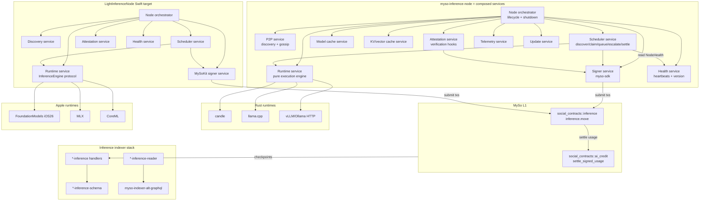
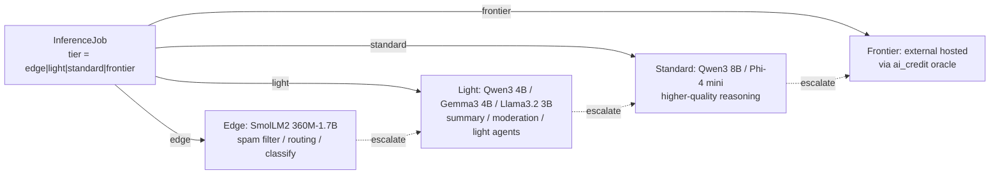
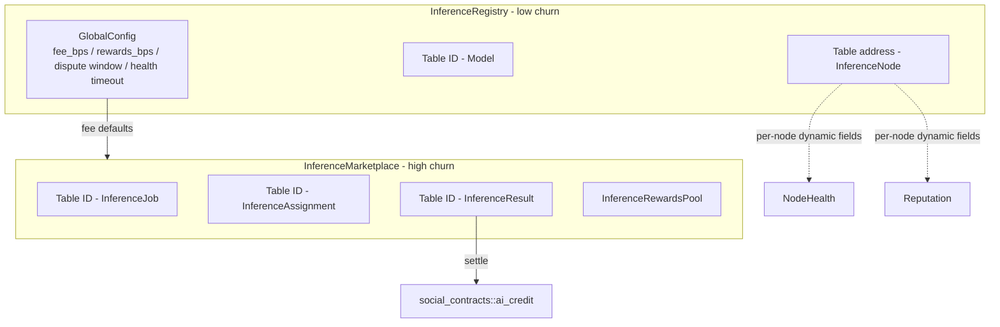
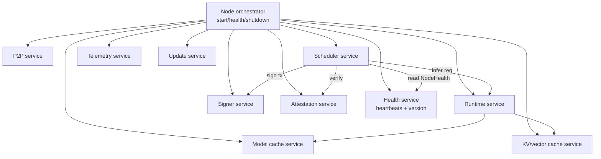
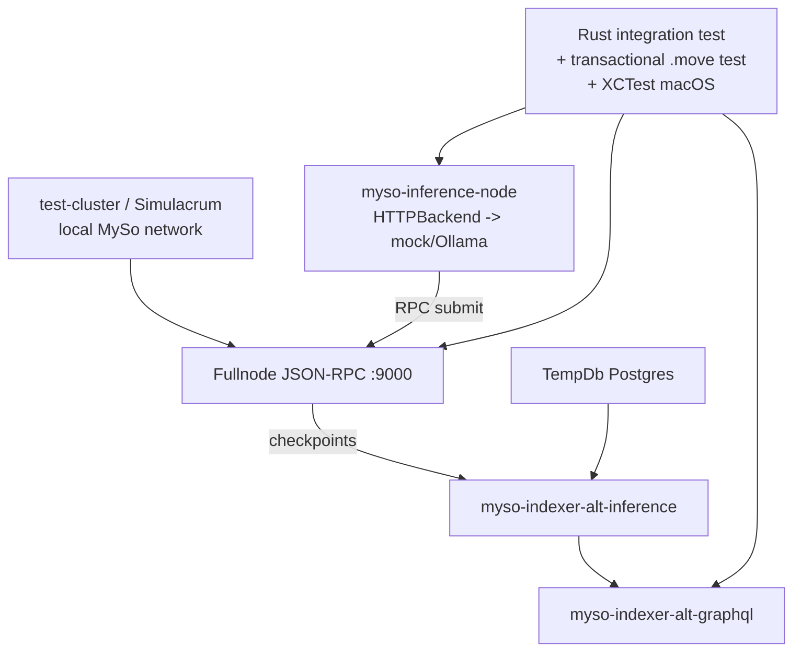

## Architecture

## Tiered model architecture

Production design uses a tiered subnet so 80–90% of requests never leave the local node; only hard prompts escalate to hosted frontier models via the existing AI credit/oracle layer. `Model` and `InferenceJob` carry a `tier: u8` so the scheduler and indexer can route and report by tier.

- **Tier constants** in `inference.move`: `TIER_EDGE=1`, `TIER_LIGHT=2`, `TIER_STANDARD=3`, `TIER_FRONTIER=4`. `Model` stores its tier; `InferenceJob` requests a tier (or a specific `model_id`).
- **Node advertising**: `InferenceNode.supported_tiers: vector<u8>` plus `capabilities: u64` (see below). `hardware_class` gates which tiers a node may serve (e.g. Apple Silicon → edge+light via MLX/CoreML; Linux GPU → light+standard; frontier → handled by the oracle, not a node).
- **Escalation**: a node that cannot serve a job at the requested tier calls `escalate_job(job, to_tier)` which re-posts the job at the higher tier and refunds/adjusts escrow. `TIER_FRONTIER` jobs are not executed by inference nodes — they are routed off-chain through `ai_credit` (the existing `USAGE_INFERENCE` settlement path) and only the receipt is recorded on-chain.
- **Cost guardrails**: `pricing_mist_per_1k` per `Model` + `max_cost_mist` per job; the scheduler estimates cost before `claim_job` and aborts if over budget.

## Capability, verification, health & reputation model

Four forward-compatibility layers reserved in v1 so the protocol can grow without storage redesign.

### Capability discovery (bitmask)

Nodes advertise what they can do, jobs require what they need — without schema migration as new modalities appear.

- Constants: `CAP_CHAT=1`, `CAP_COMPLETION=2`, `CAP_EMBEDDINGS=4`, `CAP_RERANKING=8`, `CAP_VISION=16`, `CAP_AUDIO=32`, `CAP_TOOL_CALLING=64`, `CAP_REASONING=128` (bitflags; add `CAP_*` later without breaking stored objects).
- `InferenceNode.capabilities: u64` (bitmask); `InferenceJob.capabilities_required: u64`.
- `claim_job` asserts `(node.capabilities & job.capabilities_required) == job.capabilities_required`. The scheduler's capability matcher uses the same check off-chain before claiming.
- GraphQL filters (`inferenceNodes(capabilities: [CAP!])`, `inferenceJobs(capabilitiesRequired: [CAP!])`) let clients/routers find capable nodes.

### Cryptographic verification hooks (optional in v1, required later)

`InferenceResult` reserves a `Verification` struct with all-`Option` fields so v1 can leave them empty and future verifiers (evaluator set, TEE attestation pool, zk proofs) can require them — no storage migration needed.

- `Verification { execution_receipt: Option<vector<u8>>, model_hash: Option<vector<u8>>, tokenizer_hash: Option<vector<u8>>, prompt_hash: Option<vector<u8>>, runtime_hash: Option<vector<u8>>, hardware_attestation: Option<vector<u8>>, proof: Option<vector<u8>> }` stored as a typed child object / dynamic field on `InferenceResult`.
- `commit_result` accepts an optional `verification: Option<Verification>`; v1 nodes pass `None` (or a best-effort `model_hash` + `runtime_hash` from `attestation.rs`). `verify_result(result)` is a stub in v1 that returns `true`; future versions enforce real verification and `InferenceJob.verification_required: bool` gates settlement.
- The indexer stores verification fields so analytics can track verification coverage as the network matures.

### NodeHealth (ephemeral) vs Reputation (historical)

Operational liveness is separated from long-term performance so each can be updated at its natural cadence and queried independently.

**Heartbeat is a best-effort liveness signal, not consensus-critical.** Nodes heartbeat on a configurable interval (and may epoch-batch to reduce on-chain noise/cost); clients and schedulers tolerate stale health by falling back to registry/reputation and a direct probe of the node's result endpoint before claiming.

- `NodeHealth { last_heartbeat_ms: u64, software_version: u64, protocol_version: u64, runtime_version: u64, online: bool }` — stored as a dynamic field child on `InferenceNode` (typed, upgrade-safe). Updated by a low-frequency `heartbeat` entry call from the node's Health service (configurable interval; epoch-batched option). `online` flips to `false` when `now - last_heartbeat_ms > HEALTH_TIMEOUT_MS` (checked lazily on read / by an epoch cleanup). Kept deliberately small so heartbeats stay low-gas.
- `Reputation { availability_bps: u64, latency_score: u64, accuracy_score: u64, dispute_rate_bps: u64, uptime_bps: u64, successful_jobs: u64, failed_jobs: u64, last_updated_epoch: u64, version: u64 }` — updated infrequently on `ResultConfirmed`/`ResultDisputed` and via `update_reputation`. This is historical performance, not liveness.
- The Scheduler reads `NodeHealth.online` + `last_heartbeat_ms` for health-aware load balancing, and `Reputation` for quality-weighted selection; on stale health it falls back to registry/reputation and a direct probe before claiming. GraphQL exposes both as separate sub-objects on `InferenceNode`.

### Multidimensional reputation

- `Reputation` (above) replaces a single score so clients can select nodes on the dimension that matters to them.
- `ResultConfirmed` increments `successful_jobs` and adjusts `uptime_bps`/`latency_score` (EMA); `ResultDisputed` increments `failed_jobs`/`dispute_rate_bps`; `slash_node` records a penalty. A future `EvaluatorCap` holder (or v1 `InferenceAdminCap`) can call `update_reputation(node, patch)` for off-chain evaluator contributions.
- GraphQL exposes `reputation { availability, latency, accuracy, disputeRate, uptime, successfulJobs }`.

## On-chain object model (registry vs marketplace)

Shared objects are split by churn rate to minimize contention. MySo executes transactions touching distinct shared objects in parallel; a single fat shared object would serialize all inference traffic. The registry holds low-churn reference data; the marketplace holds high-churn live protocol state — so unrelated mutations don't contend, and the marketplace can be sharded/partitioned later without touching the registry.

## Deliverable 1 — `inference.move` (single module in myso-social)

**Placement**: new module `social_contracts::inference` inside `crates/myso-framework/packages/myso-social/sources/inference.move`, alongside `ai_credit.move`. Reuses `upgrade.move`, `bootstrap.move`, and the `ai_credit` settlement API — no system-package build pipeline changes.

### Structs (v1, one file)

- `InferenceNode { id: UID, owner: address, metadata: NodeMetadata, stake: Balance<MYSO>, capabilities: u64, hardware_class: u8, supported_models: vector<String>, supported_tiers: vector<u8>, status: u8, joined_epoch: u64, pending_unstake: Option<u64>, version: u64 }` — mirrors `ValidatorMetadata` (`crates/myso-framework/packages/myso-system/sources/validator.move:68-107`) and the permissionless registration precedent in `crates/myso-framework/packages/myso-social/sources/enclave.move`. `NodeHealth` and `Reputation` attach as dynamic-field children.
- `NodeMetadata { myso_address: address, worker_pubkey_bytes: vector<u8>, endpoint_url: Url, proof_of_possession: vector<u8>, jurisdiction: String, hardware_class: u8, extra_fields: Bag }`.
- `NodeHealth { last_heartbeat_ms, software_version, protocol_version, runtime_version, online }` (dynamic field child on `InferenceNode`).
- `Reputation { availability_bps, latency_score, accuracy_score, dispute_rate_bps, uptime_bps, successful_jobs, failed_jobs, last_updated_epoch, version }` (dynamic field child on `InferenceNode`).
- `Verification { execution_receipt, model_hash, tokenizer_hash, prompt_hash, runtime_hash, hardware_attestation, proof }` (all `Option<vector<u8>>`; child of `InferenceResult`).
- `Model { id: UID, owner: address, model_id: String, tier: u8, capabilities: u64, model_hash: vector<u8>, tokenizer_hash: Option<vector<u8>>, version: u64, pricing_mist_per_1k: u64, min_hardware_class: u8, deprecated: bool }`.
- `InferenceJob { id: UID, client: address, tier: u8, model_id: Option<String>, capabilities_required: u64, input_hash: vector<u8>, max_cost_mist: u64, escrow: Balance<MYSO>, fee_bps: u64, rewards_bps: u64, verification_required: bool, deadline_ms: u64, status: u8, assignment: Option<address> }`.
- `InferenceAssignment { id: UID, job_id: ID, node: address, claimed_at: u64 }`.
- `InferenceResult { id: UID, job_id: ID, node: address, output_hash: vector<u8>, input_tokens: u64, output_tokens: u64, latency_ms: u64, cost_mist: u64, verification: Option<Verification>, settled: bool }`.
- `GlobalConfig { id: UID, default_fee_bps: u64, default_rewards_bps: u64, dispute_window_ms: u64, health_timeout_ms: u64, min_stake_mist: u64, version: u64 }` — lives in the registry; marketplace reads fee defaults from here when a job doesn't override.
- `InferenceRegistry` shared object (low churn): `Table<address, InferenceNode>`, `Table<ID, Model>`, `config: GlobalConfig`, `version: upgrade::current_version()`.
- `InferenceMarketplace` shared object (high churn): `Table<ID, InferenceJob>`, `Table<ID, InferenceAssignment>`, `Table<ID, InferenceResult>`, `rewards_pool: InferenceRewardsPool`, `settlement_nonce: u64`, `version: upgrade::current_version()`.
- `InferenceRewardsPool { id: UID, pool: Balance<MYSO>, last_distribution_epoch: u64 }` — funds stake rewards from the markup, separate from validator emissions.
- Caps: `InferenceNodeCap` (owned by operator, like `crates/myso-framework/packages/myso-system/sources/validator_cap.move`), `InferenceAdminCap` (governance/slashing/fee config/reputation), `EvaluatorCap` (future off-chain reputation updates; minted but unused in v1). **Package upgrades use the shared `UpgradeAdminCap`** (minted once in `bootstrap.move` for all of `social_contracts`), not a per-module cap — see Production concerns.

### Entry functions

`register_node` (accepts `capabilities`, `supported_tiers`; creates `NodeHealth` + `Reputation` children), `update_node_metadata`, `update_capabilities`, `pause_node`, `reactivate_node`, `add_stake`, `heartbeat` (best-effort, configurable interval / epoch-batched; updates `NodeHealth`), `register_model`, `deprecate_model`, `update_global_config` (admin), `create_job` (escrows MYSO into the marketplace, sets `fee_bps`/`rewards_bps`/`capabilities_required`/`verification_required`), `claim_job` (node; asserts supported tier + `(node.capabilities & job.capabilities_required) == required`), `escalate_job` (node, re-posts at higher tier), `commit_result` (node, `output_hash` + token counts + cost + optional `Verification`), `confirm_result` (client, releases escrow split + updates `Reputation`), `dispute_result` (client, within window + reputation penalty), `verify_result` (v1 stub), `settle_job` (calls `ai_credit::settle_signed_usage` with `usage_kind = ai_credit::usage_inference()` — `crates/myso-framework/packages/myso-social/sources/ai_credit.move:47-51,796-820`), `slash_node` (admin, from stake), `update_reputation` (admin/evaluator), `request_unstake`, `withdraw_stake`, `distribute_rewards` (per-epoch by reputation), `expire_job` (client/repo reclaim after deadline), `mark_offline` (anyone, after `health_timeout_ms`).

### Fee + slash math (v1)

- On `confirm_result`: `cost = min(cost_mist, escrow.value())`; `protocol_fee = cost * fee_bps / 10000`; `rewards_share = cost * rewards_bps / 10000`; `node_payout = cost - protocol_fee - rewards_share`; `refund = escrow.value() - cost`.
- `protocol_fee` → treasury (reuse `ai_credit` treasury or a new `InferenceTreasury`); `rewards_share` → `InferenceRewardsPool`; `node_payout` → operator balance; `refund` → client.
- `slash_node(amount, reason)`: deduct from `InferenceNode.stake`, send slashed amount to treasury; emit `NodeSlashed` with evidence hash; require `InferenceAdminCap` in v1.

### Events (stable BCS layouts — indexer depends on these)

`NodeRegistered { node, hardware_class, supported_tiers, capabilities }`, `CapabilitiesUpdated`, `NodeMetadataUpdated`, `NodePaused`, `NodeHeartbeat { node, last_heartbeat_ms, online }` (high-frequency — see indexer note), `NodeMarkedOffline`, `ModelRegistered { model_id, tier, capabilities, hash, pricing }`, `ModelDeprecated`, `GlobalConfigUpdated`, `JobCreated { job_id, client, tier, capabilities_required, max_cost, verification_required }`, `JobClaimed { job_id, node }`, `JobEscalated { job_id, from_tier, to_tier }`, `ResultCommitted { job_id, node, output_hash, cost, has_verification }`, `ResultConfirmed { job_id, node_payout, protocol_fee, rewards_share, refund }`, `ResultDisputed { job_id, node }`, `ReputationUpdated { node, successful_jobs, failed_jobs, latency_score }`, `JobSettled`, `NodeSlashed { node, amount, reason }`, `RewardsDistributed { epoch, total }`. Keep event field names/types frozen once shipped.

### Access control matrix

| Function | Cap / caller | Shared object touched |
|---|---|---|
| `register_node`, `add_stake`, `request_unstake`, `withdraw_stake`, `update_node_metadata`, `update_capabilities`, `pause_node` | `InferenceNodeCap` owner | Registry |
| `heartbeat` | `InferenceNodeCap` owner | Registry (per-node child) |
| `register_model`, `deprecate_model` | `Model.owner` | Registry |
| `update_global_config` | `InferenceAdminCap` | Registry |
| `create_job`, `confirm_result`, `dispute_result`, `expire_job` | job `client` | Marketplace |
| `claim_job`, `commit_result`, `escalate_job` | claiming node via `InferenceNodeCap` | Marketplace (+ Registry read for capability check) |
| `mark_offline` | public | Registry |
| `slash_node`, `distribute_rewards`, `update_reputation` | `InferenceAdminCap` (v1); `EvaluatorCap` later | Registry / Marketplace |
| `verify_result` | public (v1 stub) | Marketplace read |
| `settle_job` | node operator (wraps oracle-signed receipt) | Marketplace + `ai_credit` |

### Production concerns (Move)

- **Shared-object contention**: registry and marketplace are distinct shared objects so a `heartbeat` (registry) does not serialize against `claim_job`/`commit_result` (marketplace). `claim_job` reads the registry for the capability check (read-only shared-object access) and mutates the marketplace. This is the main throughput win on MySo's parallel execution.
- **Upgradability (UpgradeAdminCap — same pattern as the rest of social_contracts)**: every shared object stores `version: upgrade::current_version()`. Migration entry points (e.g. `migrate_inference_registry(reg, _: &UpgradeAdminCap, ctx)`, `migrate_inference_marketplace(mkt, _: &UpgradeAdminCap, ctx)`, `migrate_node`, `migrate_model`) take the **package-level `&UpgradeAdminCap`** — the same cap already minted once in `bootstrap.move` and used by `migrate_post_config` (`crates/myso-framework/packages/myso-social/sources/post.move:3448-3470`), `migrate_poc_config`, `migrate_config`, etc. Each migrate asserts `version < upgrade::current_version()`, bumps `version`, and calls `upgrade::emit_migration_event` (`crates/myso-framework/packages/myso-social/sources/upgrade.move:116-129`). `InferenceAdminCap` stays scoped to runtime governance (slashing, fee config, reputation) and is **not** used for version migrations. **Greenfield — no backfill**: v1 ships at `current_version()` with empty migrate stubs (version bump + emit only); there is no existing on-chain state to populate, so no `if old_version == 0` field-backfill logic. Real migrate bodies are added only in a future upgrade when a stored object actually needs transformation.
- **Conservation**: all `Balance<MYSO>` movements conserve (escrow in = payout + fee + rewards + refund); add `assert_conservation` internal checks mirroring `ai_credit` settlement invariants.
- **Replay/nonce**: `InferenceResult` is idempotent per `job_id`; `claim_job` requires job `status == OPEN` and node not already assigned; `commit_result` rejects duplicate commits.
- **Timeouts/disputes**: `deadline_ms` from `Clock` (`0x6`); `expire_job` reclaims escrow after deadline if no commit; dispute window `DISPUTE_WINDOW_MS` before auto-settle; `mark_offline` after `health_timeout_ms`.
- **Forward-compat**: `capabilities` bitmask, `Verification` all-`Option`, `NodeHealth` + `Reputation` typed children, and the registry/marketplace split all let v2 add requirements/modalities/sharding without migrating stored objects.
- **Gas**: heartbeats are small and best-effort (configurable interval, epoch-batchable) — keep `heartbeat` arg set minimal; prefer `public fun` (PTB-callable) over `public entry`; document gas-heavy paths.
- **PoP**: `proof_of_possession` verified via `ed25519::ed25519_verify` over `myso_address + worker_pubkey_bytes`.

### Bootstrap + tests

- `public(package) fun bootstrap_init(...)` creates `InferenceRegistry` + `InferenceMarketplace` + `InferenceRewardsPool` + `GlobalConfig` + `InferenceAdminCap` (+ `EvaluatorCap` reserved); wire into `crates/myso-framework/packages/myso-social/sources/bootstrap.move` next to `ai_credit::bootstrap_init` (lines 59-63).
- Tests `crates/myso-framework/packages/myso-social/tests/inference_tests.move`: register (with capabilities) → heartbeat → add_stake → register_model → create_job (capabilities_required + verification_required=false) → claim (capability match) → commit (with optional verification) → confirm → settle; escalate path; slash path; expire_job path; mark_offline path; reputation increments; conservation asserts. Follow `ai_credit_tests.move` patterns.
- Rebuild bytecode: `UPDATE=1 cargo test -p myso-framework --test build-system-packages` (see `crates/myso-framework/tests/build-system-packages.rs`).

## Deliverable 2 — `myso-inference-node` Rust crate (composed peer node)

**Shape**: new distinct node *type*, not an oracle sidecar. New crate `crates/myso-inference-node`, registered in root `Cargo.toml` `members` + `[workspace.dependencies]` (pattern at `Cargo.toml:167,763-781`). Runs as its own binary; does **not** embed `MySoNode`; talks to L1 via `MySoClientBuilder` JSON-RPC (pattern from `crates/myso-ai-credit-oracle/src/settlement.rs:95-97`); runs its own inference-P2P domain for peer/work discovery.

### Service composition

The node is a single process composed of long-running services, each owning its concern. A `Node` orchestrator wires lifecycle, health, and graceful shutdown. The `InferenceRuntime` becomes a **pure execution engine** — it only runs inference requests issued by the Scheduler, with no scheduling logic.

### Modules

- `main.rs` / `config.rs` — clap `InferenceNodeArgs` (RPC URL, GraphQL URL, signer keypath, P2P listen addr, model dir, runtime backend selection, tier filter, advertised capabilities, data dir, max concurrent jobs, fee/rewards bps, heartbeat interval). Config from file + env (`MYSO_INFER_*`).
- `node.rs` — `Node` orchestrator: starts all services, tracks readiness, drives graceful shutdown (SIGINT/SIGTERM): stop claiming → drain in-flight → flush caches → commit final state → exit.
- `services/scheduler.rs` — **first-class Scheduler service** owning: job discovery (RPC subscription/polling), claim/lease management, node-capability matching (`capabilities` bitmask), tier+hardware routing, cost estimation, local job queue, worker assignment, retry/backoff, escalation to higher tiers, settlement coordination, health-aware load balancing (reads `NodeHealth` via the Health service; skips offline/stale nodes and backends over latency budget). Bounded by `max_concurrent_jobs` semaphore.
- `services/runtime.rs` — wraps the `InferenceRuntime` trait as a service: a worker pool that executes `InferRequest`/`EmbedRequest` from the Scheduler and returns responses. No scheduling decisions here.
- `services/p2p.rs` — v1 RPC-only (registry reads + on-chain job board); libp2p gossip for model advertisement + work propagation behind a `p2p` feature flag (reuse `mysten-network`/libp2p transitive deps). On-chain registry is source of truth.
- `services/model_cache.rs` + `services/kv_cache.rs` — on-disk model cache (content-addressed by `model_hash`); in-memory KV/vector context cache per session with LRU + size cap.
- `services/signer.rs` — `MySoKeyPair` loaded from file/env (KEK-encrypted at rest in production via KMS/keyring adapter); PTB builders for `register_node`, `heartbeat`, `claim_job`, `commit_result`, `escalate_job`, `settle_job` (mirror `crates/myso-ai-credit-oracle/src/settlement.rs`).
- `services/attestation.rs` — v1: hash-based attestation (`model_hash` + `tokenizer_hash` + `runtime_hash` + config) posted on-chain at `register_node`/`commit_result`; builds the optional `Verification` struct; freshness via the Health service; TEE quotes (Nitro/SGX) and zk proofs later.
- `services/health.rs` — emits best-effort `heartbeat` txs on a configurable interval (with an epoch-batched mode to reduce on-chain noise/cost) carrying `software_version`/`protocol_version`/`runtime_version`; maintains a local view of peer `NodeHealth` for the Scheduler's load balancing, with stale-health fallback to registry/reputation and a direct probe of the peer's result endpoint; coordinates with `attestation.rs` so attestation freshness aligns with heartbeat cadence.
- `services/telemetry.rs` — Prometheus via `mysten-metrics`: jobs claimed/completed/failed by tier, infer latency p50/p95/p99, token throughput, cache hit rate, RPC errors, stake balance, capability utilization, heartbeat lag.
- `services/updater.rs` — background refresh of supported model list from on-chain `Model` table + config; hot-reload without restart.
- `runtime/mod.rs` — `#[async_trait] pub trait InferenceRuntime: Send + Sync { async fn load_model(&self, id: &str) -> Result<()>; async fn infer(&self, req: InferRequest) -> Result<InferResponse>; async fn embeddings(&self, req) -> Result<EmbedResponse>; async fn tokenize(&self, req) -> Result<TokenizeResponse>; async fn health(&self) -> Result<Health>; fn supports(&self, tier: u8) -> bool; fn capabilities(&self) -> u64; }`.
- `runtime/candle.rs` — Rust-native backend (`candle-core`/`candle-transformers`, feature-gated `candle`). CPU/Metal dev + small models (SmolLM2) in local tests without external servers.
- `runtime/http.rs` — OpenAI-compatible HTTP backend (vLLM / Ollama / llama.cpp server / OpenRouter). Default in production Linux deployments.
- `runtime/llamacpp.rs` — llama.cpp HTTP/FFI adapter (phase 1.5).
- `router.rs` — tiered + capability router used by the Scheduler: matches `InferenceJob.tier` + `capabilities_required` to a runtime that `supports(tier)` and advertises the capabilities; estimates cost from `Model.pricing_mist_per_1k` × estimated tokens; aborts over `max_cost_mist`; escalates (`escalate_job`) when no local backend can serve; routes `TIER_FRONTIER` off-chain via the `ai_credit` oracle client.
- `store.rs` — local durable state (RocksDB or sled) for in-flight jobs, claim nonces, model cache index, so the node can resume after crash without double-claiming.

### Production concerns (Rust)

- **Crash isolation**: runtime backend errors never abort the node; failed jobs surface as `commit_result` failure or release the claim so the job can be re-claimed.
- **Concurrency**: bounded worker pool per service; per-model load slots; KV cache eviction under memory pressure.
- **Retries/timeouts**: RPC submits idempotent via digest; on-chain confirmation via `waitForTransaction`; timeout → release claim; heartbeats best-effort (skip if RPC congested).
- **Key management**: signer key never logged; redacted debug; optional KMS envelope encryption.
- **Config validation**: fail fast on invalid tier/hardware/capability/backend combos; `--dry-run` to validate without claiming.
- **Deterministic builds**: pin `candle`/HF model revisions; record model/tokenizer/runtime hashes in attestation.
- **Observability**: structured tracing with a correlation id per job threaded into logs; per-service health checks surfaced to the orchestrator.
- **Apple runtimes are NOT in this crate** — they live in the Swift target (Deliverable 4). The on-chain interface is identical.

## Deliverable 3 — Inference indexer stack (mirror social trio)

New crates following the social pattern exactly:

- `crates/myso-indexer-alt-inference-schema` — Diesel migrations + `schema.rs` + `models/` for `inference_nodes` (incl. `capabilities`, `supported_tiers`), `node_health` (latest-per-node upsert: `last_heartbeat_ms`, `software_version`, `protocol_version`, `runtime_version`, `online`), `models` (incl. `tier`, `capabilities`), `inference_jobs` (incl. `capabilities_required`, `verification_required`), `inference_assignments`, `inference_results` (incl. `verification_*` columns, `has_verification`), `node_reputation` (one wide row per node, updated on `ReputationUpdated`), `inference_rewards_pool`, `slash_events`, `global_config`. Mirror `crates/myso-indexer-alt-social-schema`.
- `crates/myso-indexer-alt-inference` — binary + `setup_inference_indexer()`; one `Processor` per event type (`NodeRegisteredHandler`, `CapabilitiesUpdatedHandler`, `ModelRegisteredHandler`, `JobCreatedHandler`, `JobClaimedHandler`, `JobEscalatedHandler`, `ResultCommittedHandler`, `ResultConfirmedHandler`, `ResultDisputedHandler`, `ReputationUpdatedHandler`, `ResultSettledHandler`, `NodeSlashedHandler`, `RewardsDistributedHandler`, `GlobalConfigUpdatedHandler`) plus a `NodeHeartbeatHandler` for `NodeHeartbeat` events. Each iterates `checkpoint.transactions`, filters by `social_contracts::inference` package/module/event type, BCS-decodes events, emits rows. Pattern at `crates/myso-indexer-alt-social/src/lib.rs:86-148` and `crates/myso-indexer-alt-social/src/handlers/profiles_handler.rs:203-233`.
- `crates/myso-indexer-alt-inference-reader` — `InferencePgReader` with Diesel SELECT methods + `Loader` impls for dataloaders (batch by `node address`, `job_id`, `model_id`, `capabilities`). Mirror `crates/myso-indexer-alt-social-reader`.
- **GraphQL wiring** in `crates/myso-indexer-alt-graphql`: add `inference_database_url` CLI arg (like `social_database_url`), construct `InferencePgReader` in `start_rpc` (`crates/myso-indexer-alt-graphql/src/lib.rs:282-410`), `.data(inference_reader)`, add types under `api/types/inference/` and resolvers in `crates/myso-indexer-alt-graphql/src/api/query.rs` (root at line 118) — e.g. `inferenceNode(address)` with `health { lastHeartbeat, online, softwareVersion }` and `reputation { availability, latency, accuracy, disputeRate, uptime, successfulJobs }` sub-objects, `inferenceNodes(tier, hardwareClass, capabilities, online, first, after)`, `inferenceJobs(status, tier, capabilitiesRequired, modelId, first, after)`, `inferenceResults(node, hasVerification)`, `model(id)`, `inferenceStats(tier)`.
- Register the three new crates in root `Cargo.toml`.

### Production concerns (indexer)

- **Heartbeat indexing**: `NodeHeartbeat` volume is driven by the configurable / epoch-batched heartbeat interval (kept low by design). `node_health` uses an upsert keyed by `node address` (keep latest only) to avoid unbounded row growth; the `NodeHeartbeatHandler` is a **sequential** pipeline (single-writer upsert) to avoid hot-row contention, while other handlers stay concurrent. Optionally expose a downsampled history table behind a feature flag for SLA analytics.
- **Idempotency**: all `commit()` inserts use `on_conflict_do_nothing`/`on_conflict_(...)_do_update` keyed by `(tx_digest, event_seq)` so replays are safe.
- **Watermarks**: per-pipeline watermark table; support `--task`/`--reader-interval-ms` catch-up/replay without racing the pruner.
- **Migrations**: versioned Diesel migrations embedded via `embed_migrations!`; run at startup.
- **Pagination**: GraphQL connections (relay-style) for list resolvers; DataLoader batching for nested node/model/job/health/reputation lookups.
- **Consistent store**: optionally mirror live `InferenceNode` + `NodeHealth` state into `myso-indexer-alt-consistent-store` for low-latency routing queries.
- **Health**: `/health` + `/metrics` via `myso-indexer-alt-metrics`; readiness gated on watermark catch-up.

## Deliverable 4 — `LightInferenceNode` Swift target in myso-swift-kit

**Shape**: new SPM target inside `Package.swift` at `/Users/brandonshaw/Offline-Projects/ProjectYZ/myso-swift-kit/Package.swift`. Add `.target(name: "LightInferenceNode", dependencies: ["MySoKit"])`, `.library(name: "LightInferenceNode", targets: ["LightInferenceNode"])` product, and `LightInferenceNodeTests` test target. Keep `Package.swift:7` platform minimums (iOS 17/macOS 13) unchanged; gate Apple ML with `@available`. The Swift target is a full protocol implementation (not just an SDK wrapper): an iPhone, MacBook, or GPU server all present the same on-chain `InferenceNode` interface.

### Sources under `Sources/LightInferenceNode/`

- `Node.swift` — orchestrator composing long-running services (mirror of the Rust `Node`): start/health/shutdown, background task management.
- `Services/SchedulerService.swift`, `Services/RuntimeService.swift`, `Services/DiscoveryService.swift`, `Services/SignerService.swift`, `Services/AttestationService.swift`, `Services/HealthService.swift`, `Services/ModelCacheService.swift`, `Services/TelemetryService.swift` — Swift counterparts of the Rust services. Scheduler owns job discovery, claim/lease, capability+tier matching, cost estimation, local queue, retry/backoff, escalation, settlement coordination, health-aware load balancing (reads `NodeHealth`, falls back to registry/reputation + direct probe on stale health). HealthService emits best-effort `heartbeat` txs on a configurable interval (epoch-batched on iOS to save battery/cost).
- `InferenceEngine.swift` — `public protocol InferenceEngine: Sendable { func load(_ id: String) async throws; func infer(_ req: InferRequest) async throws -> InferResponse; func embeddings(_ req: EmbedRequest) async throws -> EmbedResponse; func tokenize(_ req: TokenizeRequest) async throws -> TokenizeResponse; func health() async throws -> Health; func supports(tier: UInt8) -> Bool; var capabilities: UInt64 { get } }` (Swift mirror of the Rust trait; pure execution engine).
- `Backends/FoundationModelsBackend.swift` — `@available(iOS 26, macOS 26, *)` wrapper around `FoundationModels` `LanguageModelSession` (light/standard tiers on Apple Silicon).
- `Backends/MLXBackend.swift` — MLX SPM dependency, gated (light/standard).
- `Backends/CoreMLBackend.swift` — `CoreML` system framework (edge/light).
- `Backends/HTTPBackend.swift` — OpenAI-compatible HTTP fallback (works on all platforms, no iOS 26 gate) — also used in XCTest on macOS CI.
- `TierRouter.swift` — tiered + capability router used by the Scheduler.
- `Capabilities.swift` — `enum InferenceCapability: UInt64 { chat=1, completion=2, embeddings=4, reranking=8, vision=16, audio=32, toolCalling=64, reasoning=128 }` + bitmask helpers.
- `Verification.swift` — `struct Verification { executionReceipt, modelHash, tokenizerHash, promptHash, runtimeHash, hardwareAttestation, proof }` (all optional) attached to committed results.
- `NodeHealth.swift` + `Reputation.swift` — local mirrors of on-chain `NodeHealth` (ephemeral) and `Reputation` (historical) for client-side node selection.
- `InferenceNodeClient.swift` — uses `MySoKit.MySoProvider` + `TransactionBlock.moveCall(...)` (`Sources/MySoKit/Types/Structs/Builders/Transactions/TransactionBlock/TransactionBlock.swift:387-402`) + `signAndExecuteTransactionBlock` (`Sources/MySoKit/Types/Structs/Provider/MySoProvider.swift:108-122`) to call `inference.move` entry points (`register_node`, `heartbeat`, `claim_job`, `commit_result`, `escalate_job`, `settle_job`).
- `KeyManagement.swift` — signer key in Keychain (iOS/macOS) with Secure Enclave P-256 when available; fallback to MySoKit `Account` keystore.
- `Persistence.swift` — on-device job/claim state (SwiftData or file-backed) for crash recovery; offline queue for commits when network is unavailable.
- `Examples/iOS_Inference_Example/` — sample app mirroring `Examples/iOS_Example/iOS_Example/View Models/HomeViewModel.swift` showing register (with capabilities + tiers) → heartbeat → claim → infer → commit (with verification), with tier/capability selection UI.

### Production concerns (Swift)

- **Key storage**: Keychain + Secure Enclave; never log keys.
- **Background constraints**: `ProcessInfo` thermal/battery checks; pause claiming and throttle heartbeats under thermal pressure; honor `UIApplication` background task limits (heartbeats suspended in background on iOS).
- **Model download/cache**: fetch MLX/CoreML weights on demand, content-addressed, LRU eviction; respect user storage limits.
- **Privacy**: prompts/outputs stay on-device; only `input_hash`/`output_hash` (+ optional verification hashes) go on-chain.
- **Offline queue**: commits + heartbeats queued locally and retried; claim timeouts handled by `expire_job` on-chain.
- **Testability**: `HTTPBackend` + protocol-based services mean the full chain flow is testable in XCTest on macOS CI without Apple ML hardware.

**MLX dependency**: add `.package(url: "https://github.com/ml-explore/mlx-swift.git", from: ...)` to `Package.swift` deps and only link it into `LightInferenceNode` (not `MySoKit`), so `MySoKit` stays lightweight.

## Local E2E testing (no GPU required)

Goal: every deliverable is testable end-to-end on a developer laptop (and in CI) with no GPU and no Apple ML hardware. The topology mirrors `crates/myso-indexer-alt-e2e-tests` `OffchainCluster` + `FullCluster` (`crates/myso-indexer-alt-e2e-tests/src/lib.rs:75-126,299+`).

### Move contract tests

- Unit tests in `inference_tests.move` run via the framework build (`UPDATE=1 cargo test -p myso-framework --test build-system-packages`).
- Transactional test under `crates/myso-indexer-alt-e2e-tests/tests/` (a `.move` script) that registers a node (with capabilities), heartbeats, creates a job (with `capabilities_required` + `verification_required=false`), claims, commits (with optional `Verification`), confirms, settles; snapshot GraphQL output with `insta` (pattern at `crates/myso-indexer-alt-e2e-tests/tests/transactional_tests.rs:54-63`).

### Rust integration test (no GPU)

- New `myso-inference-node/tests/local_e2e.rs` (or an e2e crate) using `test-cluster` to spin up a local network.
- Inference node uses `HTTPBackend` pointed at an in-process **mock OpenAI-compatible server** (a tiny `axum`/`wiremock` stub returning canned completions) OR an optional local `ollama serve` if `OLLAMA_BASE_URL` is set. No GPU, no large downloads.
- Flow: `register_node` (capabilities+tiers) → `heartbeat` (assert `NodeHealth.online`) → `register_model` (edge tier, capabilities) → `create_job` (capabilities_required) → Scheduler claims (capability match) → `commit_result` (with `Verification{model_hash, runtime_hash}`) → `confirm_result` → assert effects + indexer rows + GraphQL query returns the result + `reputation.successfulJobs == 1` + `health.online == true`.
- Assert conservation (escrow in = payouts out), idempotent replays, job expiry path, escalation path (edge job with no edge backend → `escalate_job` to light), `mark_offline` after `health_timeout_ms`.

### Indexer + GraphQL tests

- Extend `OffchainCluster` to register the inference indexer pipelines against `TempDb` Postgres; wait for catch-up via `wait_for_indexer`/`wait_for_graphql`.
- GraphQL field tests: `inferenceNode` (incl. `health` + `reputation` sub-fields), `inferenceNodes(capabilities: [CHAT], online: true)`, `inferenceJobs(capabilitiesRequired: [EMBEDDINGS])`, `inferenceResults(hasVerification: true)`, `inferenceStats(tier)`.

### Swift tests (macOS CI)

- `LightInferenceNodeTests` XCTest using `HTTPBackend` against the same mock server; `InferenceNodeClient` tested against the local test-cluster RPC (or a recorded fixture). Verifies PTB construction for `register_node`/`heartbeat`/`claim_job`/`commit_result` (incl. `Verification` + `capabilities` encoding) matches expected BCS.
- FoundationModels/MLX/CoreML backends compiled but only exercised on real Apple Silicon devices (gated tests with `#if targetEnvironment(simulator)` / `@available` skips).

### docker-compose (local full stack)

`docker/compose/inference-e2e.yaml`:
- `fullnode` (image or built from `crates/myso-node`) running a local dev network.
- `ollama` (CPU) serving SmolLM2 360M as the `edge` tier backend (optional; mock server is the GPU-free default).
- `inference-node` built from `crates/myso-inference-node`, `MYSO_INFER_BACKEND=http`, `MYSO_INFER_HTTP_URL=http://ollama:11434`.
- `postgres` for the inference indexer.
- `inference-indexer` + `graphql` from the new crates.
- One `make inference-e2e` target that brings the stack up, runs the Rust integration test, tears down.

### CI matrix

- **Move**: `UPDATE=1 cargo test -p myso-framework --test build-system-packages` then `cargo simtest -p myso-e2e-tests` for the new transactional test.
- **Rust (no GPU)**: `MYSO_SKIP_SIMTESTS=1 cargo nextest run -p myso-inference-node -p myso-indexer-alt-inference -p myso-indexer-alt-inference-reader`; `cargo simtest` for the test-cluster integration test.
- **Lint**: `./scripts/lint.sh` and `cargo fmt --all -- --check` (do **not** run `cargo xclippy`).
- **Swift**: `swift test` on macOS runner (HTTPBackend only); Apple-ML tests skipped on CI.

## Cross-cutting

- All on-chain actions (`register_node`, `heartbeat`, `claim_job`, `commit_result`, `escalate_job`, `settle_job`) are identical across the Rust fullnode and the Swift light node — the chain sees one `InferenceNode` interface regardless of hardware.
- `settle_job` reuses `ai_credit::settle_signed_usage` (do not duplicate settlement). The inference % markup (`rewards_bps`) funds `InferenceRewardsPool` (distributed by reputation per epoch) plus protocol fee to treasury — completely separate from validator emission pool (`crates/myso-framework/packages/myso-system/sources/staking_pool.move:348-351`).
- Tiered + capability routing keeps 80–90% of requests on local nodes (edge/light/standard); only `TIER_FRONTIER` escalates off-chain via the existing `ai_credit`/oracle layer.
- Registry/marketplace split minimizes shared-object contention on MySo's parallel execution and leaves room to shard the marketplace later.
- `NodeHealth` (ephemeral) is separated from `Reputation` (historical); verification hooks, capability bitmask, and the registry/marketplace split are reserved in v1 so the protocol can require/extend them in v2 without storage migration.
- Lint/format: `./scripts/lint.sh`, `cargo fmt --all -- --check` (do **not** run `cargo xclippy`); rebuild Move bytecode after Move changes; `swift format` / `swift test` for Swift.
- Implementation order (for sequencing only — **no git, no PRs**: do NOT run git CLI or create branches/commits/tags/pushes/PRs/reviews; all work is in-place file edits, owner handles version control): (1) Move module + tests, (2) indexer trio + GraphQL + e2e harness, (3) Rust node + Rust integration test, (4) Swift target + XCTest, (5) docker-compose + CI wiring.

## Open items to confirm during execution

- Final `inference.move` event struct layouts (needed by indexer handlers) — define events next to each entry function and keep BCS structs stable; lock before shipping indexer handlers.
- `fee_bps` / `rewards_bps` defaults (in `GlobalConfig`) and whether treasury reuses `ai_credit` treasury or a new `InferenceTreasury`.
- Heartbeat cadence + `health_timeout_ms` defaults (best-effort, configurable, epoch-batchable; stale health tolerated via registry/reputation + direct probe), and whether the indexer stores latest-only (default) or a downsampled history.
- Whether v1 P2P in the Rust node ships RPC-only (default) or includes libp2p gossip behind a feature flag.
- MLX version pin and whether CoreML/MLX model assets are vendored or fetched on demand.
- Whether `TIER_FRONTIER` jobs store only the `ai_credit` receipt on-chain (preferred) or also an `InferenceResult` stub.
- SmolLM2/Qwen3 quantization and context length defaults per tier (affects `pricing_mist_per_1k` and `max_cost_mist` defaults).
- Which `Verification` fields (if any) are populated by v1 nodes (recommend best-effort `model_hash` + `runtime_hash`) and whether `verification_required` defaults to `false` for all v1 jobs.
- `Reputation` update policy in v1: on-chain incremental from `ResultConfirmed`/`ResultDisputed` only, or also periodic `update_reputation` from an `EvaluatorCap` service.
- Marketplace sharding/partitioning is explicitly **out of scope for v1** — the split only prepares the seam.
