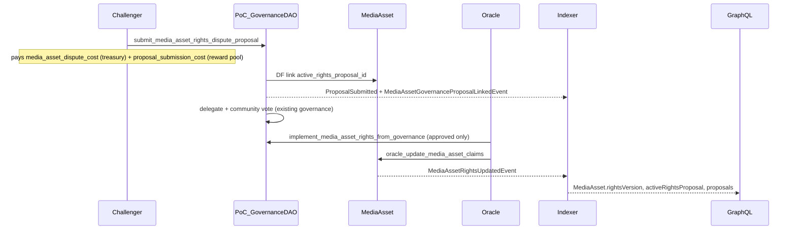
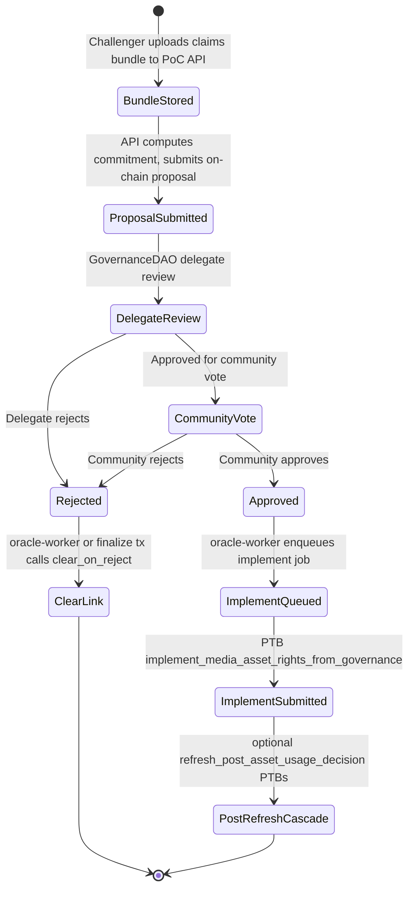

# Media Asset Rights DAO Integration (Full Stack)

## Architecture

Two dispute paths coexist under PoC:

| Path | Mechanism | Fee config | Outcome |
|------|-----------|------------|---------|
| **Post PoC dispute** (existing) | Stake-weighted `PoCDispute` on `Post` | `PoCConfig.dispute_cost` | Clears/changes post composition badge & redirection |
| **Media asset rights dispute** (new) | PoC `GovernanceDAO` proposal → oracle implement | `PoCConfig.media_asset_dispute_cost` + registry `proposal_submission_cost` | Updates on-chain `MediaAsset` claims/rights via `oracle_update_media_asset_claims` |



**Pattern to mirror:** SPoT governance in [`social_proof_of_truth.move`](crates/myso-framework/packages/myso-social/sources/social_proof_of_truth.move) (`submit_spot_resolution_proposal_to_governance` → link → `implement_spot_resolution_from_governance` → `clear_*_on_reject`).

**Reuse (no new registry):** `PoCConfig.dispute_governance_registry_id` → existing PoC `GovernanceDAO` (`PROPOSAL_TYPE_PROOF_OF_CREATIVITY = 1`).

**Greenfield assumption:** This is a breaking, non-backward-compatible change set. No migration shims for old `PoCConfig` layouts, nullable GraphQL fallbacks, or optional indexer columns. Schema, Move structs, and API types are updated in lockstep.

**Non-goals (v1):**
- Do not merge post stake-voting disputes into governance
- Do not auto-refresh embedded post composition on asset rights implement (existing `refresh_post_asset_usage_decision` remains oracle-triggered separately)
- Do not add second-round fee multiplier for media asset disputes (single `media_asset_dispute_cost` only)

---

## 1. Move Smart Contracts

### 1a. PoCConfig extensions — [`proof_of_creativity.move`](crates/myso-framework/packages/myso-social/sources/proof_of_creativity.move)

Add to `PoCConfig`:
- `media_asset_dispute_cost: u64` — treasury fee for initiating a media-asset rights challenge (default: **10 MYSO**, 2× post `dispute_cost`, tunable by admin)
- `max_disputes_per_media_asset: u8` — lifetime cap per asset (default: **2**, mirrors post cap)

Wire through:
- `bootstrap_init` / `PoCConfigUpdatedEvent` / `update_poc_config` (new params — **breaking signature change**, update all call sites and tests)
- Public getters: `media_asset_dispute_cost()`, `max_disputes_per_media_asset()`

### 1b. Proposal kind constants + metadata schema

In `proof_of_creativity.move`:

```move
const POC_PROPOSAL_KIND_GENERAL: u8 = 0;
const POC_PROPOSAL_KIND_MEDIA_ASSET_RIGHTS: u8 = 1;
```

**Required `metadata_json` fields** (validated on submit):

```json
{
  "poc_proposal_kind": "media_asset_rights",
  "claims_commitment": "<32-byte hex>",
  "evidence_urls": ["..."],
  "related_post_id": "<optional post address>"
}
```

- `reference_id` on the governance `Proposal` = `MediaAsset` object ID (same as existing PoC proposal storage in [`governance.move`](crates/myso-framework/packages/myso-social/sources/governance.move) L1249–1258)
- Distinction from general PoC proposals: metadata `poc_proposal_kind` + dedicated submit entry

### 1c. MediaAsset dispute state (DF — struct at field limit)

[`media_asset.move`](crates/myso-framework/packages/myso-social/sources/media_asset.move) already has 20+ struct fields; **do not add fields**. Use dynamic fields on `MediaAsset.id`:

```move
struct MediaAssetRightsDisputeState has store, drop {
    active_proposal_id: Option<ID>,
    rights_disputes_submitted: u8,
    pending_claims_commitment: Option<vector<u8>>, // set at submit, verified at implement
}
```

Helpers (package-visible): `borrow_rights_dispute_state`, `assert_no_active_rights_proposal`, `link_rights_proposal`, `clear_rights_proposal`, `increment_rights_disputes_submitted`.

**Submit authorization (production):**
- Any sender paying fees
- Asset must exist and have `rights_version >= 1` (registered)
- No active rights proposal
- `rights_disputes_submitted < max_disputes_per_media_asset`
- Registry ID must match `config.dispute_governance_registry_id`

**v1:** mark targeted claims `claim_disputed()` on submit (uses existing constant at L174); revert to prior status on reject.

### 1d. New entry functions — `proof_of_creativity.move`

| Entry | Purpose |
|-------|---------|
| `submit_media_asset_rights_dispute_proposal` | Validates asset + metadata; splits `media_asset_dispute_cost` → treasury; calls governance submit (reference_id = asset ID); links DF; emits link event |
| `finalize_media_asset_rights_governance_proposal` | Wraps `governance::finalize_proposal`; on reject calls `clear_media_asset_rights_proposal_on_reject` (mirrors `finalize_spot_governance_proposal`) |
| `implement_media_asset_rights_from_governance` | **Oracle sender** (via `config.oracle_address` check inside `oracle_update_media_asset_claims`); asserts proposal approved + matches active link; validates `hash(claims) == pending_claims_commitment`; calls `proof_of_creativity::oracle_update_media_asset_claims`; `governance::mark_proposal_implemented_take_pool`; clears DF |
| `finalize_media_asset_rights_via_dao` | Convenience entry: `implement_media_asset_rights_from_governance` with default reasoning if none supplied (mirrors SPoT `finalize_via_dao`) |
| `clear_media_asset_rights_proposal_on_reject` | Callable after governance rejection; clears DF without mutating claims |

Add governance package helper (like SPoT):

```move
// governance.move
public(package) fun submit_poc_proposal_and_return_id(...): ID
```

### 1e. Events (new)

- `MediaAssetRightsDisputeProposedEvent { media_asset_id, proposal_id, submitter, claims_commitment, timestamp }`
- `MediaAssetGovernanceProposalLinkedEvent { media_asset_id, proposal_id, timestamp }`
- `MediaAssetGovernanceProposalClearedEvent { media_asset_id, proposal_id, outcome, timestamp }`
- Existing `MediaAssetRightsUpdatedEvent` emitted by `oracle_update_media_asset_claims` (already at L378–382)

### 1f. Move tests

New module [`tests/media_asset_rights_dispute_tests.move`](crates/myso-framework/packages/myso-social/tests/media_asset_rights_dispute_tests.move):

- Happy path: submit → approve → implement → rights_version bump
- Reject clears link without claim mutation
- Fee insufficiency, wrong registry, active proposal collision, cap exceeded
- Claims commitment mismatch at implement
- Non-oracle implement fails

---

## 2. Social Indexer Stack

### 2a. Schema migration — new file `20260816000000_media_asset_rights_disputes/up.sql`

Breaking greenfield migration (no `IF NOT EXISTS` shims, required columns from day one):

```sql
CREATE TABLE media_asset_governance_links (
    media_asset_id TEXT NOT NULL,
    proposal_id TEXT NOT NULL,
    submitter TEXT NOT NULL,
    claims_commitment BYTEA NOT NULL,
    status SMALLINT NOT NULL, -- 1=active, 2=implemented, 3=rejected, 4=cleared
    related_post_id TEXT NULL,
    rights_disputes_submitted SMALLINT NOT NULL,
    transaction_id TEXT NOT NULL,
    time TIMESTAMPTZ NOT NULL DEFAULT NOW(),
    PRIMARY KEY (media_asset_id, proposal_id, time)
);

CREATE TABLE media_asset_rights_updates (
    media_asset_id TEXT NOT NULL,
    rights_version BIGINT NOT NULL,
    proposal_id TEXT NULL,
    transaction_id TEXT NOT NULL,
    time TIMESTAMPTZ NOT NULL DEFAULT NOW(),
    PRIMARY KEY (media_asset_id, rights_version, time)
);

ALTER TABLE poc_config
    ADD COLUMN media_asset_dispute_cost BIGINT NOT NULL,
    ADD COLUMN max_disputes_per_media_asset SMALLINT NOT NULL;
```

Update [`schema.rs`](crates/myso-indexer-alt-social-schema/src/schema.rs), [`models/poc.rs`](crates/myso-indexer-alt-social-schema/src/models/poc.rs), [`models/media_asset.rs`](crates/myso-indexer-alt-social-schema/src/models/media_asset.rs) — all new fields **required** in Rust models and insert paths.

### 2b. Event handlers

**[`handlers/poc.rs`](crates/myso-indexer-alt-social/src/handlers/poc.rs):**
- Extend `PocConfigUpdatedEvent` deserialization + `NewPocConfiguration` with new fields (required, no optional fallback)

**New [`handlers/media_asset_rights.rs`](crates/myso-indexer-alt-social/src/handlers/media_asset_rights.rs):**
- `MediaAssetRightsDisputeProposedEvent`
- `MediaAssetGovernanceProposalLinkedEvent` / `ClearedEvent`
- `MediaAssetRightsUpdatedEvent` → upsert `media_asset_rights_updates`, bump `media_assets.rights_version` on latest asset row

**[`handlers/events.rs`](crates/myso-indexer-alt-social/src/handlers/events.rs):**
- Add BCS structs + `parse_media_asset_event` for rights events (currently stub/missing for `MediaAssetRightsUpdatedEvent`)

**[`handlers/governance.rs`](crates/myso-indexer-alt-social/src/handlers/governance.rs):**
- Link table populated from dedicated linked event (ordering correctness); no optional subtype column needed

**[`handlers/posts_handler.rs`](crates/myso-indexer-alt-social/src/handlers/posts_handler.rs):** register new event names in routing if needed.

### 2c. PG reader — [`myso-indexer-alt-social-reader`](crates/myso-indexer-alt-social-reader/)

New functions in `media_asset.rs`:
- `get_active_rights_proposal_for_asset(media_asset_id)`
- `list_media_asset_rights_proposals(media_asset_id, limit, offset)`
- `list_media_asset_rights_updates(media_asset_id, limit, offset)`

Expose via [`pg_reader.rs`](crates/myso-indexer-alt-social-reader/src/pg_reader.rs).

---

## 3. GraphQL API

Breaking schema additions — [`schema.graphql`](crates/myso-indexer-alt-graphql/schema.graphql):

**`PocConfig`** (new required fields):
- `mediaAssetDisputeCost: BigInt!`
- `maxDisputesPerMediaAsset: Int!`

**New type `MediaAssetRightsUpdate`:**
- `mediaAssetId`, `rightsVersion`, `proposalId`, `transactionId`, `time`

**`MediaAsset` extensions** — [`api/types/media_asset.rs`](crates/myso-indexer-alt-graphql/src/api/types/media_asset.rs):
- `activeRightsProposal: Proposal`
- `rightsDisputesSubmitted: Int!`
- `rightsProposals(limit, offset): [Proposal!]`
- `rightsUpdates(limit, offset): [MediaAssetRightsUpdate!]`

**`Proposal` extension** — [`api/types/governance.rs`](crates/myso-indexer-alt-graphql/src/api/types/governance.rs):
- `mediaAsset(ctx): MediaAsset` when `proposal_type=1` and link/metadata indicates media asset rights

**Query root** — [`api/query.rs`](crates/myso-indexer-alt-graphql/src/api/query.rs):
- `mediaAssetRightsProposals(mediaAssetId: ID!, limit, offset): [Proposal!]`

**`social_config.rs`:** expose new PocConfig fields as required.

Regenerate SDL snapshots as part of implementation (`test_schema_sdl_export`).

---

## 4. PoC Oracle — Media Asset Rights Governance (proof-of-creativity repo)

**Critical path:** On-chain governance approval alone does **not** mutate `MediaAsset` claims. The **PoC oracle worker** must observe approved proposals and submit implement PTBs. Today SPoT has the same gap for `implement_spot_resolution_from_governance` (CLI-only); media asset rights must ship with an **automated worker** from day one.

**Repo:** sibling [`proof-of-creativity`](../proof-of-creativity) (spawned by [`local_poc.rs`](crates/myso/src/local_poc.rs) as `oracle-worker`). Reference implementation pattern: [`myso-spot-oracle/src/blockchain/settle.rs`](crates/myso-spot-oracle/src/blockchain/settle.rs) (`ProgrammableTransactionBuilder` + shared object args + nonce/idempotency).

### 4a. End-to-end oracle lifecycle



### 4b. Claims bundle storage (off-chain, commitment-bound)

The on-chain proposal stores only a **32-byte `claims_commitment`** in metadata/DF. Full `Claim[]` + `UsageGrant[]` are too large for `metadata_json`. The PoC API owns the bundle lifecycle:

**New table** in proof-of-creativity Postgres (`media_asset_rights_bundles`):

| Column | Type | Notes |
|--------|------|-------|
| `proposal_id` | TEXT PK | On-chain proposal object ID |
| `media_asset_id` | TEXT | Must match proposal `reference_id` |
| `claims_commitment` | BYTEA | SHA3-256 of canonical BCS payload |
| `claims_bcs` | BYTEA | Serialized `vector<Claim>` |
| `usage_grants_bcs` | BYTEA | Serialized `vector<UsageGrant>` |
| `submitter` | TEXT | Must match on-chain proposal submitter |
| `status` | TEXT | `pending` / `approved` / `implemented` / `rejected` |
| `created_at` | TIMESTAMPTZ | |

**Commitment algorithm** (must match Move on-chain check exactly):

```text
payload = bcs::to_bytes(&(claims, usage_grants))
claims_commitment = sha3_256(payload)
```

**API endpoints** (proof-of-creativity `api` service):

- `POST /disputes/media-asset-rights/prepare` — validate bundle, return commitment + estimated fees
- `POST /disputes/media-asset-rights/submit` — persist bundle, build+submit `submit_media_asset_rights_dispute_proposal` PTB (or return unsigned PTB for client signing)
- `GET /disputes/media-asset-rights/{proposal_id}/bundle` — oracle-worker only (auth: oracle key); returns BCS for PTB encoding

Bundle is **immutable** after submit. If governance rejects, mark `status=rejected` but retain for audit.

### 4c. Object ID resolution (chain session)

Oracle worker resolves shared object IDs the same way existing PoC integration does:

| Object | Env var (proof-of-creativity `.env`) | Source |
|--------|--------------------------------------|--------|
| `PoCConfig` | `POC_CONFIG_OBJECT_ID` | session refresh / `MYSO_REFRESH_SESSION_OBJECTS` |
| PoC `GovernanceDAO` | `POC_GOVERNANCE_REGISTRY_ID` | must equal `PoCConfig.dispute_governance_registry_id` |
| `EcosystemTreasury` | `ECOSYSTEM_TREASURY_OBJECT_ID` | bootstrap session |
| `Clock` | `0x6` | system object |
| `MediaAsset` | from proposal `reference_id` | per job |
| `Proposal` | from poll result | per job |

Localnet stable oracle key: [`network.config/poc/oracle-localnet.env`](network.config/poc/oracle-localnet.env) (`POC_DEFAULT_ORACLE_ADDRESS`, `POC_DEFAULT_ORACLE_PRIVATE_KEY_HEX`).

**Pre-flight checks** before every PTB:
1. `PoCConfig.oracle_address == worker signer address` (worker must use oracle key, not admin key)
2. `registry.id == config.dispute_governance_registry_id`
3. On-chain DF `active_rights_proposal_id == proposal_id`
4. Indexer link row `status == active` (cross-check off-chain state)

### 4d. Rust PTB builders (new module)

Add `proof-of-creativity/crates/poc-oracle/src/blockchain/media_asset_rights.rs` (mirror spot-oracle layout):

#### Tx 1 — Finalize governance (when voting period ends)

Only needed if no other actor calls `governance::finalize_proposal`. Worker should handle this automatically.

**Move entry:** `proof_of_creativity::finalize_media_asset_rights_governance_proposal`

**Argument order:**

1. `config: &PoCConfig` — shared immutable
2. `registry_gov: &mut GovernanceDAO` — shared mutable
3. `proposal: &mut Proposal` — shared mutable
4. `asset: &mut MediaAsset` — shared mutable
5. `ecosystem_treasury: &EcosystemTreasury` — shared immutable
6. `clock: &Clock` — shared immutable

On reject, Move clears asset DF link inside this tx. Worker marks bundle `rejected` and **does not** enqueue implement.

#### Tx 2 — Implement approved rights (core oracle tx)

**Move entry:** `proof_of_creativity::implement_media_asset_rights_from_governance`

**Argument order:**

1. `config: &PoCConfig` — shared immutable
2. `registry_gov: &mut GovernanceDAO` — shared mutable
3. `proposal: &mut Proposal` — shared mutable
4. `asset: &mut MediaAsset` — shared mutable
5. `treasury: &EcosystemTreasury` — shared immutable
6. `claims: vector<Claim>` — pure (BCS-decoded from bundle)
7. `usage_grants: vector<UsageGrant>` — pure
8. `reasoning: String` — pure (from proposal description or operator override)
9. `evidence_urls: Option<vector<String>>` — pure (from proposal metadata)
10. `clock: &Clock` — shared immutable

**Internal call chain:** entry → `oracle_update_media_asset_claims(config, asset, claims, grants, clock, ctx)` → emits `MediaAssetRightsUpdatedEvent` → `mark_proposal_implemented_take_pool` → clears DF → emits `MediaAssetGovernanceProposalClearedEvent`.

**PTB encoding notes:**
- Use `ProgrammableTransactionBuilder` + `shared_object_arg()` with correct mutability (same helpers as spot-oracle)
- `Claim` and `UsageGrant` are Move structs — serialize via existing PoC BCS helpers used for `finalize_media_asset` (add shared `encode_claims_for_ptb` / `encode_usage_grants_for_ptb` if not present)
- Gas budget: start at `100_000_000`; tune from localnet traces
- Sign with **oracle keypair** (`ORACLE_PRIVATE_KEY_{NETWORK}`)

#### Tx 3 — Post refresh cascade (separate PTB per binding, optional but recommended)

Rights implement does **not** auto-refresh embedded post composition. After successful implement, worker queries GraphQL for posts referencing the asset:

```graphql
query PostsUsingAsset($assetId: ID!) {
  mediaAsset(id: $assetId) {
    usages(limit: 100) { containerId containerType position }
  }
}
```

For each `containerType == POST`, submit one PTB per embedded binding:

**Move entry:** `post::refresh_post_asset_usage_decision`

**Argument order:**

1. `oracle: address` — pure (signer address; must equal `PoCConfig.oracle_address`)
2. `post: &mut Post` — shared mutable
3. `asset: &MediaAsset` — shared immutable
4. `binding_id: u64` — pure
5. `clock: &Clock` — shared immutable

Resolve `binding_id` from post's on-chain `EmbeddedAssetBinding` list (fetch post object via RPC) or from indexer `post_enforcement` data if already indexed.

Enqueue refresh jobs **after** implement tx confirms; skip containers already at latest `rights_version`.

### 4e. Governance-rights worker (oracle-worker extension)

Add poller loop to existing `oracle-worker` (do not create a third worker process):

**Poll interval:** `POC_GOVERNANCE_POLL_INTERVAL_SECS` (default 30s)

**GraphQL poll query** (against social indexer GraphQL — same URL PoC already uses for post hydration):

```graphql
query PendingMediaAssetRightsProposals($registryId: ID!) {
  proposals(
    registryId: $registryId
    proposalType: 1
    status: APPROVED
    limit: 20
  ) {
    id
    referenceId
    metadataJson
    status
    votingEndTime
  }
  # Also fetch proposals in VOTING with votingEndTime < now for finalize
}
```

Filter client-side: `metadataJson.poc_proposal_kind == "media_asset_rights"`.

**Job types** (proof-of-creativeness job queue / Postgres, mirror spot-oracle `SpotJob` pattern):

| Job type | Trigger | Action |
|----------|---------|--------|
| `poc_gov_finalize_rights` | `votingEndTime` passed, status still `VOTING` | Submit Tx 1 |
| `poc_gov_implement_rights` | status `APPROVED`, link active, bundle `pending` | Submit Tx 2 |
| `poc_gov_refresh_post_binding` | implement confirmed | Submit Tx 3 per binding |
| `poc_gov_mark_rejected` | finalize returned reject | Update bundle status |

**Idempotency:**
- Nonce key: `implement-rights-{proposal_id}` in transactions table
- Skip if indexer link `status == implemented` or on-chain DF has no active proposal
- Skip implement if bundle commitment != on-chain `pending_claims_commitment`

**Error handling:**
- Commitment mismatch → mark job failed, alert operator (do not retry blindly)
- `EWrongProposal` / `ENoActiveProposal` → re-fetch state, likely already implemented
- RPC transient errors → exponential backoff requeue

### 4f. Config and env vars (proof-of-creativity)

Add to `.env` / docker-compose:

```bash
# Governance rights implement
POC_GOVERNANCE_POLL_INTERVAL_SECS=30
POC_GOVERNANCE_REGISTRY_ID=<from bootstrap>
POC_CONFIG_OBJECT_ID=<from bootstrap>
ECOSYSTEM_TREASURY_OBJECT_ID=<from bootstrap>
SOCIAL_GRAPHQL_URL=http://host.docker.internal:8080/graphql  # or indexer-alt-graphql URL
POC_GOVERNANCE_IMPLEMENT_ENABLED=true
POC_POST_REFRESH_AFTER_RIGHTS_IMPLEMENT=true
```

Worker must refuse to start `POC_GOVERNANCE_IMPLEMENT_ENABLED=true` if oracle address in config object != signer address.

### 4g. myso-core integration points (documentation + E2E)

**README section** in [`myso-social/README.md`](crates/myso-framework/packages/myso-social/README.md) — add after SPoT governance CLI block:

```bash
# 1) Prepare + submit media asset rights dispute (via PoC API or direct call)
# 2) Governance delegate + community vote runs automatically
# 3) Oracle worker finalizes + implements when approved:

myso client call --package 0x...d880 \
  --module proof_of_creativity --function implement_media_asset_rights_from_governance \
  --args [POC_CONFIG_ID] [POC_GOV_REGISTRY_ID] [PROPOSAL_ID] [MEDIA_ASSET_ID] \
        [ECOSYSTEM_TREASURY_ID] [CLAIMS_VEC] [USAGE_GRANTS_VEC] \
        "Implementation reasoning" [EVIDENCE_URLS_OPTION] [CLOCK_ID] \
  --gas-budget 100000000
```

**E2E script** (optional follow-up in myso-core): extend `scripts/poc-oracle-post-runnable.sh` or add `scripts/poc-media-asset-rights-runnable.sh` that:
1. Creates/resolves a `MediaAsset`
2. Submits rights dispute proposal with known bundle
3. Fast-forwards governance (testnet admin helpers)
4. Asserts oracle-worker implement tx + `MediaAssetRightsUpdatedEvent` in indexer

### 4h. Oracle verification (proof-of-creativity)

| Check | Command |
|-------|---------|
| PTB builders compile | `cargo check -p poc-oracle` (or equivalent crate name in proof-of-creativity) |
| Worker integration | Manual/localnet: `myso start --with-poc` + submit test dispute + watch worker logs |
| Commitment round-trip | Unit test: BCS encode → SHA3-256 → matches Move test vector |

This is **in addition to** myso-core verification in section 5. The feature is not production-complete until both stacks pass.

---

## 5. Verification

| Layer | Command | Scope |
|-------|---------|-------|
| **Move** | `myso move build -e testnet` then `myso move test -e testnet` | Run from [`crates/myso-framework/packages/myso-social/`](crates/myso-framework/packages/myso-social/) only |
| **Social stack + GraphQL** | `cargo check` | Touched crates: `-p myso-indexer-alt-social -p myso-indexer-alt-social-schema -p myso-indexer-alt-social-reader -p myso-indexer-alt-graphql` |

No separate `cargo nextest`, `cargo xclippy`, or `./scripts/lint.sh` gate for this feature unless failures surface during `cargo check`.

Implementation still includes Move unit tests (`media_asset_rights_dispute_tests.move`) and indexer handler unit tests where they add meaningful coverage, but the **verification gate** for sign-off is the two commands above.

---

## Key Files Summary

| Area | Primary files |
|------|---------------|
| Move config + entries | [`proof_of_creativity.move`](crates/myso-framework/packages/myso-social/sources/proof_of_creativity.move) |
| Asset DF + oracle path | [`media_asset.move`](crates/myso-framework/packages/myso-social/sources/media_asset.move) |
| Governance submit helper | [`governance.move`](crates/myso-framework/packages/myso-social/sources/governance.move) |
| DB migration | `migrations/20260816000000_media_asset_rights_disputes/` |
| Indexer handlers | `handlers/media_asset_rights.rs`, `handlers/poc.rs`, `handlers/events.rs` |
| GraphQL | `api/types/media_asset.rs`, `api/types/social_config.rs`, `api/types/governance.rs`, `api/query.rs` |
| PoC oracle (proof-of-creativity) | `crates/poc-oracle/src/blockchain/media_asset_rights.rs`, governance-rights worker, `media_asset_rights_bundles` table, API dispute endpoints |
