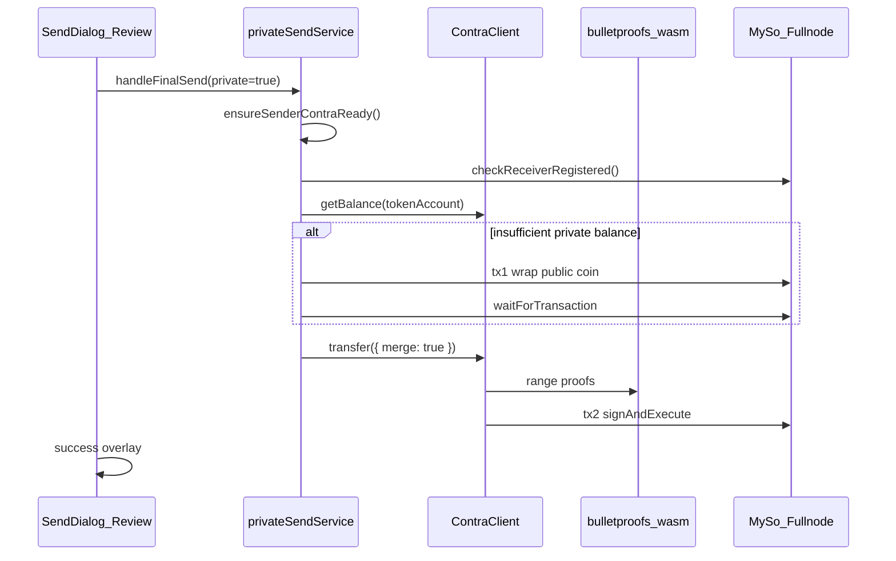

# Private Balance Send — Implementation Plan

## Goal

Enable **private sends** of **MySo (MYSO)** and **myUSD** from the existing profile/wallet send flow in [mysocial-frontend](file:///Users/brandonshaw/Offline-Projects/ProjectYZ/mysocial-frontend). UX is intentionally minimal: one **iOS-style toggle** on the **Review** step of [send-dialog.tsx](file:///Users/brandonshaw/Offline-Projects/ProjectYZ/mysocial-frontend/components/sections/wallet/send-dialog.tsx), below the summary rows and above the Send button. All cryptography and proof generation run **client-side** using [@socialproof/contra](file:///Users/brandonshaw/Offline-Projects/ProjectYZ/myso-ts-sdks/packages/contra) + WASM bulletproofs; only MySo RPC/fullnode is required.

## Architecture



### What already exists

| Layer | Status |
|-------|--------|
| On-chain protocol | Complete in [contra.move](file:///Users/brandonshaw/Offline-Projects/ProjectYZ/myso-core/crates/myso-framework/packages/contra/sources/contra.move) (`0xc1fe`) |
| TS SDK | Production-ready PTB + proof builders in [contra/src/client.ts](file:///Users/brandonshaw/Offline-Projects/ProjectYZ/myso-ts-sdks/packages/contra/src/client.ts) |
| E2E reference | [operations.ts](file:///Users/brandonshaw/Offline-Projects/ProjectYZ/myso-ts-sdks/packages/contra/test/e2e/operations.ts) — wrap → merge → transfer |
| Frontend send flow | [send-dialog.tsx](file:///Users/brandonshaw/Offline-Projects/ProjectYZ/mysocial-frontend/components/sections/wallet/send-dialog.tsx) — public `splitCoins` + `transferObjects` today |
| Indexer/GraphQL | **No contra support** — balances/history via RPC + client decrypt only |

### Critical constraints

1. **Confidential tokens must be issued on-chain** — `TokenRegistry.new<MYSO>()` and `TokenRegistry.new<MYUSD>()` are **not in genesis**. A one-time admin tx per network must create and share `ConfidentialToken<T>` for each coin (see [token_issuer.ts](file:///Users/brandonshaw/Offline-Projects/ProjectYZ/myso-ts-sdks/packages/contra/test/e2e/token_issuer.ts)).
2. **Receiver registration requires receiver signature** — anyone can `newAccount` + `shareAccount` for a recipient, but `register` must be signed by the account owner. Receivers who have never opened the app cannot receive private sends until they complete one-time setup (see Phase 2).
3. **Auto-wrap cannot be a single SDK call** — proof generation reads on-chain state *before* building the PTB. Wrap changes state, so auto-wrap is **wrap tx → wait → transfer tx (with `merge: true`)**. The SDK already prepends `merge` inside `transfer()` when pending deposits exist.
4. **No external proof server** — WASM + `@noble/curves` NIZKs run in browser; fullnode proxy at `/api/fullnode` is sufficient.

---

## Phase 0 — On-chain prerequisites (myso-core / ops)

**Owner:** protocol/admin (not frontend). Block frontend QA until complete on target network.

1. **Confirm contra package + registries on testnet/mainnet**
   - Package ID: `0xc1fe` ([myso-types](file:///Users/brandonshaw/Offline-Projects/ProjectYZ/myso-core/crates/myso-types/src/lib.rs))
   - Fetch shared `AccountRegistry` and `TokenRegistry` object IDs from contra `init` effects (or framework snapshot publish tx)

2. **Issue confidential tokens**
   - `new_confidential_token<MYSO>(treasury_cap, auditor_pks, ctx)` → share `ConfidentialToken<MYSO>`
   - Repeat for `MYUSD` (`::myusd::MYUSD` from [bridge/move/tokens/myusd](file:///Users/brandonshaw/Offline-Projects/ProjectYZ/myso-core/bridge/move/tokens/myusd/sources/myusd.move))
   - Configure auditor keys (can start with empty set like e2e, or production auditor set)

3. **Publish network config for the frontend**
   - Add to [mysocial-chain-addresses.ts](file:///Users/brandonshaw/Offline-Projects/ProjectYZ/mysocial-frontend/lib/mysocial-chain-addresses.ts) (or new `lib/contra-config.ts`):

```ts
export interface ContraChainConfig {
  packageId: string           // 0xc1fe
  accountRegistryId: string
  tokenRegistryId: string
  mysoCoinType: string        // 0x2::myso::MYSO
  myusdCoinType: string       // full repr from indexer
}
```

   - Extend GraphQL chain-address discovery or env override (`NEXT_PUBLIC_MYSOCIAL_CHAIN_OVERRIDES`) so testnet/mainnet IDs stay in sync

**Success criteria:** `client.contra.getAuditors(coinType)` and `getObject(deriveConfidentialTokenId(coinType))` succeed on testnet.

---

## Phase 1 — Frontend SDK wiring

### 1.1 Dependencies

Add to [package.json](file:///Users/brandonshaw/Offline-Projects/ProjectYZ/mysocial-frontend/package.json):

- `@socialproof/contra` (workspace or published version aligned with `@socialproof/myso@0.0.4`)
- `@socialproof/contra-bulletproofs-wasm`

Pin versions together; bump `@socialproof/myso` if contra requires a newer client API.

### 1.2 Extend MySo client

Refactor [myso-client.ts](file:///Users/brandonshaw/Offline-Projects/ProjectYZ/mysocial-frontend/lib/myso-client.ts):

```ts
import { contra, DiscreteLogTable } from '@socialproof/contra'

let contraTablePromise: Promise<DiscreteLogTable> | null = null
let contraReadyPromise: Promise<void> | null = null

export function getContraExtendedClient() {
  const base = getMySoClient()
  return base.$extend(contra({
    packageConfig: getContraPackageConfig(),
    table: awaitOrSyncTable(),
    wasmUrl: '/contra/contra_bulletproofs_wasm_bg.wasm',
  }))
}
```

### 1.3 Browser bundler setup ([next.config.mjs](file:///Users/brandonshaw/Offline-Projects/ProjectYZ/mysocial-frontend/next.config.mjs))

- Copy WASM asset to `public/contra/` at build time (or use `asset/resource` webpack rule)
- Enable `experiments: { asyncWebAssembly: true }` if needed
- Exclude contra worker + WASM from Terser (same pattern as existing worker exclusions)
- Serve discrete-log worker from `public/contra/compute-table-entries.js` (copy from `@socialproof/contra/workers/`)

### 1.4 Warm-up provider

Add `ContraProvider` (or hook into existing wallet provider):

- On authenticated session + MySo network ready:
  - `DiscreteLogTable.createAsync(16, { workerUrl: '/contra/compute-table-entries.js' })`
  - `await client.contra.warmUpProofs()`
- Show non-blocking init; first private send may wait if warm-up incomplete

---

## Phase 2 — Contra service layer (core logic)

Create **`lib/contra/`** module (mirrors e2e [operations.ts](file:///Users/brandonshaw/Offline-Projects/ProjectYZ/myso-ts-sdks/packages/contra/test/e2e/operations.ts)):

### 2.1 `token-account-store.ts`

Persist `TokenAccount` ElGamal private keys per `(network, address, coinType)`:

- Load/create `TokenAccount` via SDK constructor (auto-generates key if missing)
- Store scalar in `localStorage` keyed alongside existing auth keys in [useMySocialAuth.ts](file:///Users/brandonshaw/Offline-Projects/ProjectYZ/mysocial-frontend/hooks/useMySocialAuth.ts)
- **v1:** localStorage acceptable for testnet; document upgrade path to Web Crypto / secure enclave for mainnet

### 2.2 `ensure-contra-account.ts`

Idempotent sender setup (run on login + before first private send):

| Step | On-chain | Tx signer |
|------|----------|-----------|
| Account missing | `newAccount` + `shareAccount` | sender |
| Not registered for token | `register({ tokenAccount, auditorPublicKeys })` | sender |

Use `client.contra.getPublicKey(address, coinType)` to detect registration (`TokenAccountDoesNotExistError` → needs register).

Bundle `newAccount` + `shareAccount` in **one PTB** (e2e pattern). `register` is a **separate tx** (async proof generation).

### 2.3 `check-receiver-ready.ts`

Before enabling private toggle or at send time:

```ts
try {
  await client.contra.getPublicKey(recipientAddress, coinType)
  return { ready: true }
} catch (e) {
  if (e instanceof TokenAccountDoesNotExistError) {
    return { ready: false, reason: 'Recipient has not enabled private receives' }
  }
  throw e
}
```

If not ready: disable toggle with helper text, or toast on send attempt. **Cannot** register on behalf of recipient.

**Mitigation:** run `ensureContraAccount()` for every user on first wallet connect so most active users are pre-registered.

### 2.4 `private-send.ts` — main orchestrator

```ts
export async function executePrivateSend({
  keypair, senderAddress, recipientAddress, coinType, amountBaseUnits, onProgress,
}: PrivateSendParams): Promise<TransactionDigest>
```

**Flow** (modeled on e2e `wrapCoin` + `transfer`):

1. `ensureContraAccount(sender, coinType)`
2. `checkReceiverReady(recipient, coinType)` — abort if false
3. Load `TokenAccount` from store
4. `getBalance(tokenAccount)` — compute spendable private balance
5. **If spendable < amount:**
   - `listSpendableNativeCoins` (reuse [send-dialog.tsx](file:///Users/brandonshaw/Offline-Projects/ProjectYZ/mysocial-frontend/components/sections/wallet/send-dialog.tsx) helpers)
   - Build wrap tx: `splitCoins` → `client.contra.wrap({ coin, receiver: senderAddress, tokenType })`
   - `executeTransactionWithSmartGas` → `waitForTransaction`
   - Toast/progress: "Funding private balance..."
6. **Transfer tx:**
   - `const addTransfer = await client.contra.transfer({ tokenAccount, receiverAddress, amount: amountBaseUnits, merge: true })`
   - Build `Transaction`, `tx.add(addTransfer)`, sign via existing [transaction-utils.ts](file:///Users/brandonshaw/Offline-Projects/ProjectYZ/mysocial-frontend/lib/transaction-utils.ts)
   - Progress: "Generating proofs..." (this step may take 1–3s)
7. Return digest; optimistic cache update on **public** balance (wrap consumed coins)

**Error mapping:**

| Error | User message |
|-------|--------------|
| `InsufficientBalanceError` | Not enough MySo/myUSD (public + private) |
| `ReceiverDoesNotAcceptDepositsError` | Recipient cannot receive private transfers |
| `TokenAccountDoesNotExistError` | Setup incomplete |
| Proof/tx failure | Retry; link to explorer |

### 2.5 Coin type mapping

Extend [wallet-native-balances.ts](file:///Users/brandonshaw/Offline-Projects/ProjectYZ/mysocial-frontend/lib/wallet-native-balances.ts):

```ts
export function nativeCoinTypeForTokenId(id: 'myso' | 'myusd', balanceNodes): string
```

Resolve full struct tag from GraphQL `coinType.repr` (same pattern as public send).

---

## Phase 3 — UI integration (minimal surface)

### 3.1 Toggle placement

In `renderReviewStage()` of [send-dialog.tsx](file:///Users/brandonshaw/Offline-Projects/ProjectYZ/mysocial-frontend/components/sections/wallet/send-dialog.tsx), **after** the Duration row (~line 1253) and **before** the Send button:

```tsx
{selectedToken?.id === 'myso' || selectedToken?.id === 'myusd' ? (
  <div className="flex items-center justify-between py-3 border-t border-[var(--border)]">
    <div>
      <p className="text-sm font-chakra-petch text-[var(--primary)]">Private send</p>
      <p className="text-xs font-space-grotesk text-[var(--muted-foreground)]">
        Hide the amount on-chain
      </p>
    </div>
    <Switch
      checked={usePrivateSend}
      onCheckedChange={setUsePrivateSend}
      disabled={!receiverPrivateReady || contraInitializing}
    />
  </div>
) : null}
```

Use existing [Switch](file:///Users/brandonshaw/Offline-Projects/ProjectYZ/mysocial-frontend/components/ui/switch.tsx) (Radix, iOS-style pill).

### 3.2 Review summary updates

When `usePrivateSend`:

- Add row: **Privacy** → "Private" (replace or supplement Duration row)
- Amount row still shows human-readable amount to user (only chain observers lose visibility)

### 3.3 `handleFinalSend` branch

```tsx
if (usePrivateSend && (selectedToken.id === 'myso' || selectedToken.id === 'myusd')) {
  await executePrivateSend({ ... })
} else {
  // existing splitCoins + transferObjects path
}
```

### 3.4 Loading UX

Private send may require **2 transactions** (wrap + transfer). Extend progress toasts:

1. "Setting up private account..." (first-time only)
2. "Funding private balance..." (wrap)
3. "Generating zero-knowledge proofs..."
4. "Submitting private transfer..."

Keep existing success overlay (`SuccessCheck`, auto-close, explorer link).

### 3.5 Balance validation

When private toggle ON, max sendable = **public coin balance** (auto-wrap source). No need to query private balance in v1 UI; service handles wrap. Disable toggle if total public balance < amount.

Pre-fetch receiver readiness when recipient is selected (profile pre-fill path) to avoid surprise at review.

---

## Phase 4 — Login-time provisioning (seamless background)

Add to wallet auth bootstrap (after keypair available):

```ts
void ensureContraAccount({ address, keypair, coinTypes: [MYSO, MYUSD] })
```

- Fire-and-forget with retry; log failures silently unless user attempts private send
- Ensures **sender** is always ready; dramatically reduces first-send latency

---

## Phase 5 — Testing

### Unit (Vitest or existing test runner if added)

- Coin type resolution
- TokenAccount store round-trip
- Error message mapping

### Manual E2E checklist (testnet)

1. User A first login → contra account created (verify via explorer `Account` object)
2. User A public send (toggle off) — regression
3. User A private send to User B (both registered) — encrypted `TransferEvent`, no public amount
4. User A private send with zero private balance — auto-wrap then transfer (2 txs)
5. User A private send to unregistered User C — toggle disabled / clear error
6. myUSD private send (same flows)
7. Mobile viewport — toggle renders correctly (wallet-card compact layout)

### SDK parity

Run contra e2e locally against same network config to validate object IDs before frontend QA.

---

## Out of scope (v1) — future backend work

These improve UX but are **not required** for the toggle + client-side send:

| Item | Why defer |
|------|-----------|
| Indexer handlers for `TransferEvent` / `WrapEvent` | History works via RPC events; no GraphQL today |
| GraphQL `privateBalance` field | Client decrypt via `getBalance()` suffices |
| Wallet overview private balance display | Separate UI effort |
| `myso-contra` Rust SDK completion | TS SDK is the frontend path |
| Receiver auto-registration | Cryptographically impossible without receiver key |
| Single-tx wrap+transfer | Requires custom proof orchestration beyond SDK `transfer()` |

---

## File change summary

| File | Change |
|------|--------|
| [mysocial-frontend/package.json](file:///Users/brandonshaw/Offline-Projects/ProjectYZ/mysocial-frontend/package.json) | Add contra deps |
| [mysocial-frontend/next.config.mjs](file:///Users/brandonshaw/Offline-Projects/ProjectYZ/mysocial-frontend/next.config.mjs) | WASM + worker assets |
| [mysocial-frontend/lib/myso-client.ts](file:///Users/brandonshaw/Offline-Projects/ProjectYZ/mysocial-frontend/lib/myso-client.ts) | Contra client extension |
| `mysocial-frontend/lib/contra/*.ts` | **New** — config, store, ensure, private-send |
| [mysocial-frontend/lib/mysocial-chain-addresses.ts](file:///Users/brandonshaw/Offline-Projects/ProjectYZ/mysocial-frontend/lib/mysocial-chain-addresses.ts) | Contra registry IDs |
| [mysocial-frontend/components/sections/wallet/send-dialog.tsx](file:///Users/brandonshaw/Offline-Projects/ProjectYZ/mysocial-frontend/components/sections/wallet/send-dialog.tsx) | Toggle + branch in `handleFinalSend` |
| Wallet auth hook / provider | Background `ensureContraAccount` |
| myso-core / ops (admin) | Issue `ConfidentialToken<MYSO>` + `<MYUSD>` |

---

## Risk register

| Risk | Mitigation |
|------|------------|
| Confidential tokens not deployed | Phase 0 gate; feature flag `NEXT_PUBLIC_CONTRA_ENABLED` |
| Proof generation slow on mobile | Warm-up on login; progress UI; consider Web Worker for table (already supported) |
| Receiver not registered | Pre-check + disable toggle; onboarding copy |
| Wrap amount is public in `WrapEvent` | Accept for v1 auto-wrap; document that **transfer amount** is private, wrap metadata is not |
| `@socialproof/contra` API instability (README warns experimental) | Pin version; wrap SDK calls in `lib/contra/` adapter |
