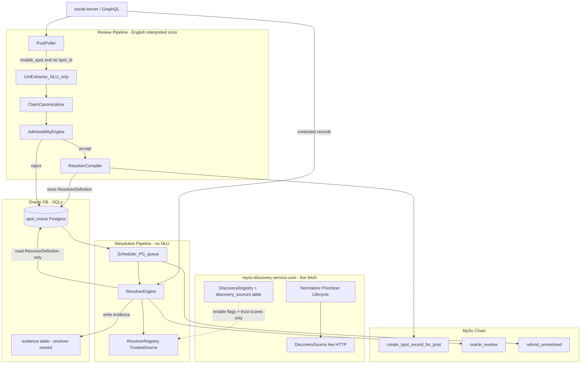

# SPoT Oracle Server V1

## Context and constraints

**On-chain reality today** ([`social_proof_of_truth.move`](crates/myso-framework/packages/myso-social/sources/social_proof_of_truth.move)):
- Oracle holds `SpotOracleAdminCap` and calls `create_spot_record_for_post` (market creation) and `oracle_resolve` (outcome + `confidence_bps` + reasoning + evidence URLs).
- Low confidence escalates to `STATUS_DAO_REQUIRED`; timeout path uses `refund_unresolved`.
- There is **no on-chain claim-review queue**—that entire pipeline is off-chain in V1.

**Existing read/index layer (do not duplicate):**
- Indexer: [`spot_handler.rs`](crates/myso-indexer-alt-social/src/handlers/spot_handler.rs) → `spot_*` tables in social Postgres (Diesel).
- Read API: [`myso-social-server` `/spot/*`](crates/myso-social-server/src/server/handlers/spot.rs).

**Best template:** [`myso-ai-credit-oracle`](crates/myso-ai-credit-oracle/) — Axum server, clap/env config, background Tokio workers, PTB submission via `myso-sdk` ([`settlement.rs`](crates/myso-ai-credit-oracle/src/settlement.rs)).

**Source-discovery layer (reuse + upgrade):** [`myso-discovery-service`](crates/myso-discovery-service/) provides reusable primitives but **today only has fake adapters**:
- [`manual_curated.rs`](crates/myso-discovery-service/src/sources/adapters/manual_curated.rs) — replays static YAML `entries` (not a live fetch)
- [`stub.rs`](crates/myso-discovery-service/src/sources/adapters/stub.rs) — returns `Ok(vec![])` for every poll
- [`sources.localnet.yaml`](crates/myso-discovery-service/config/discovery/sources.localnet.yaml) — empty `entries: []`; no real sources configured

**V1 requirement:** upgrade discovery-core with **real network-fetching `DiscoverySource` adapters** before SPoT E2E. YAML/DB config registers *where* to fetch (feed URLs, GitHub repo slugs, API bases, optional API keys) — it must **not** be the primary data path via hand-curated fake entries.

Reusable primitives (keep):
- `DiscoverySource` trait in [`sources/mod.rs`](crates/myso-discovery-service/src/sources/mod.rs)
- `DiscoveryRegistry` (renamed from `SourceRegistry`) in [`sources/registry.rs`](crates/myso-discovery-service/src/sources/registry.rs)
- `DiscoveryDomain` (`Creative` / `Factual`)
- `discovery_sources` table (trust scores, enabled, `last_polled_at`, `config` JSONB for fetch params)
- Asset lifecycle FSM ([`lifecycle.rs`](crates/myso-discovery-service/src/lifecycle.rs)), normalizer, prioritizer
- PG job queue pattern in [`store/mod.rs`](crates/myso-discovery-service/src/store/mod.rs) — reused as a *pattern* by SPoT, not imported
- Schema crate [`myso-discovery-service-schema`](crates/myso-discovery-service-schema/)

Today the discovery lib ([`lib.rs`](crates/myso-discovery-service/src/lib.rs)) exposes `runtime`, `scheduler`, `embed_client`, `store`, `api`, `admin`, `jobs`, `metrics`, `identity` alongside the reusable primitives. Importing it whole would pull the discovery runtime into SPoT. **Plan: split the crate** (see Phase 1.1) so SPoT depends only on the core primitives.

`DiscoverySource::discover()` returns **candidate content**; it does not settle markets. SPoT needs a **separate** `TrustedSource::resolve()` contract that produces deterministic evidence.

**Your decisions:**
- V1 uses **existing contract only** (off-chain review gates chain txs).
- V1 ships **full framework**, **category-based adapters** (crypto + news/events + GitHub fully implemented; others scaffolded behind traits).
- **No further abstraction in V1** — build, observe real market types, evolve from usage.
- **Scheduler:** standardize on the discovery-service **PG job-queue pattern** (re-implemented in spot-oracle); drop Redis.
- **Two separate traits:** `DiscoverySource` (discover candidate content) stays in discovery-core; `TrustedSource` (produce deterministic settlement evidence) is defined in `myso-spot-oracle`. Factual adapters implement both, in their respective crates; creative adapters implement only `DiscoverySource`; pure-oracle adapters (Chainlink/CoinGecko/Coinbase) implement only `TrustedSource`.
- **Dependency boundary:** SPoT depends on discovery **core primitives only** (traits, registry, lifecycle, models, config parsing) — never on scheduler, runtime, or workers.
- **Evidence ≠ discovery assets:** discovery assets are candidate corpus, not oracle evidence. The resolver never reads from or writes to `discovery_assets`.
- **Registry naming:** `DiscoveryRegistry` (holds `DiscoverySource`) and `ResolverRegistry` (holds `TrustedSource`) — names match responsibility.
- **Real sources, not YAML fakery:** discovery and SPoT adapters perform live HTTP/API fetches in E2E. YAML/`discovery_sources.config` is registration + parameters only. `manual_curated` remains for isolated unit tests only, not the default E2E path.

---

## End-to-end architecture



**Pipeline contract:**

```
LLM → Canonicalize → Rules → Resolver Compiler → Scheduler → Resolve
```

- **Review phase** (runs once per claim): LLM extracts structured fields; canonicalizer normalizes them; rule engine validates admissibility; **Resolver Compiler** produces an immutable `ResolverDefinition` and persists it.
- **Resolution phase** (runs on schedule): scheduler and resolver engine **never interpret English** — they only load the stored `ResolverDefinition` and execute it against `TrustedSource` adapters in the `ResolverRegistry`.

**Two-trait boundary:**
- `DiscoverySource::discover()` — "find candidate content that might be useful" (continuous crawl; owned by discovery-core, used by PoC).
- `TrustedSource::resolve()` — "produce deterministic evidence that can settle a market" (point query at maturity; owned by `myso-spot-oracle`, used by SPoT).
- Factual adapters (e.g. GitHub Releases) implement both, in their respective crates. Creative adapters (MusicBrainz) implement only `DiscoverySource`. Pure-oracle adapters (Chainlink) implement only `TrustedSource`.
- **No adapter implementation is shared across crates; only the conceptual capability is shared.** A factual source may have a `DiscoverySource` impl in discovery-core and an independent `TrustedSource` impl in spot-oracle. Do not DRY these into one abstraction.

**Discovery ↔ resolver boundary:**
- The resolver reads `discovery_sources` only for **enable flags + trust scores** (dashed edge above).
- Discovery assets (`discovery_assets`) are **candidate corpus**, not oracle evidence. The resolver never reads or writes them. Evidence rows are produced solely by `TrustedSource::resolve()` and live in the resolver-owned `evidence` table.

**Hard rule:** LLM output is structured claim fields only. Approval, confidence, and resolution outcome are **always** computed in deterministic Rust.

---

## Crate layout

Split the discovery crate so SPoT gets a hard dependency boundary, then add the two SPoT crates:

```
crates/myso-discovery-service-core/     # NEW lib: sources (trait + DiscoveryRegistry + types), lifecycle, normalizer, prioritizer, source-config YAML loader. No runtime/scheduler/embed/store/api/admin/jobs/metrics/identity.
crates/myso-discovery-service/          # bin: depends on -core; keeps runtime, scheduler, embed_client, store, api, admin, jobs, metrics, identity, clap config
crates/myso-discovery-service-schema/   # existing: migrations (shared by both services' DBs)
crates/myso-spot-oracle-schema/         # NEW: SPoT-specific SQLx migrations + row types
crates/myso-spot-oracle/                # NEW single binary: myso-spot-oracle
  → depends on myso-discovery-service-core        # traits, DiscoveryRegistry, lifecycle, models, config parsing ONLY
  → depends on myso-discovery-service-schema      # discovery_sources schema (run in spot_oracle DB)
  → does NOT depend on myso-discovery-service     # never imports runtime/scheduler/workers/store
```

Register new crates in root [`Cargo.toml`](Cargo.toml). Rename `SourceRegistry` → `DiscoveryRegistry` in `-core` (re-export `SourceRegistry` as a deprecated alias for one release to avoid breaking in-flight discovery code).

### `myso-spot-oracle` module map

| Module | Responsibility |
|--------|----------------|
| `config` | Figment (TOML + env) with clap overrides; `SPOT_ORACLE_*` prefix; reuses discovery-core source-config YAML loader + `SourceConfig` types |
| `runtime` | Bootstrap, Tokio task spawning, graceful shutdown (spot-oracle's own — not imported from discovery) |
| `api` | Public REST (review status, markets, evidence, health) |
| `admin` | Secret-gated admin routes (replay, pause, adapter disable) |
| `review` | Claim ingestion, LLM extraction, canonicalization, rule engine |
| `review/compiler` | **Resolver Compiler** — turns accepted claim into stored `ResolverDefinition` |
| `resolver` | `Resolver` trait, definition execution, outcome mapping (no NLU) |
| `sources` | **`TrustedSource` trait** (resolve), `ResolverRegistry`, health, circuit breakers |
| `sources/adapters/` | `TrustedSource` impls: pure-oracle adapters (chainlink/coingecko/coinbase) + factual resolvers (github_releases, rss_event, http_official); scaffold stubs for the rest |
| `discovery` | Thin read-only integration over discovery-core: load `discovery_sources` rows (own sqlx queries, not discovery's `store`), build `ResolverRegistry` from enabled factual sources + trust scores. Does NOT crawl, does NOT touch `discovery_assets`. |
| `scheduler` | PG-backed queue re-implementing the `discovery_jobs` pattern (`FOR UPDATE SKIP LOCKED`, priority, attempts, `run_after`, DLQ) — no Redis, not imported |
| `rss` | RSS watchers → enqueue resolver jobs (trigger only); feed list from `discovery_sources` rows with `adapter_type='rss'` |
| `blockchain` | PTB builders for create/resolve/refund; idempotency |
| `signer` | Key loading, tx dedup, audit log |
| `social_client` | GraphQL + social-server HTTP client |
| `jobs` | Cleanup, reconciliation, chain sync |
| `metrics` | Prometheus + tracing (via `myso-indexer-alt-metrics` pattern) |
| `store` | SQLx repositories for SPoT-specific tables + read-only `discovery_sources` queries |

**Entry point** (mirror ai-credit-oracle):

```rust
#[tokio::main]
async fn main() -> anyhow::Result<()> {
    telemetry init;
    let args = OracleArgs::parse();
    runtime::serve(args).await
}
```

---

## Phase 1 — Foundation (single binary boots)

### 1.1 Project scaffolding + discovery-core split

**Split `myso-discovery-service` first (hard dependency boundary):**
- Move into new `myso-discovery-service-core` lib: `sources` (`DiscoverySource` trait, `DiscoveryRegistry`, `types`, **`HttpFetchClient`** shared reqwest wrapper with timeouts/retries/user-agent), `lifecycle`, `normalizer`, `prioritizer`, and the source-config YAML loader (move `load_sources_config` from `runtime.rs` into core, e.g. `sources/config_loader`).
- `myso-discovery-service` (bin) depends on `-core`; keeps `runtime`, `scheduler`, `embed_client`, `store`, `api`, `admin`, `jobs`, `metrics`, `identity`, `config` (clap `DiscoveryArgs`).
- Re-export `SourceRegistry` as deprecated alias for `DiscoveryRegistry` for one release.

**Then scaffold SPoT:**
- Create [`crates/myso-spot-oracle/Cargo.toml`](crates/myso-spot-oracle/Cargo.toml) with deps: `tokio`, `axum`, `clap`, `figment`, `sqlx`, `reqwest`, `serde`, `anyhow`, `myso-sdk`, `myso-types`, `prometheus`, `telemetry-subscribers`, `myso-indexer-alt-metrics`, **`myso-discovery-service-core` + `myso-discovery-service-schema`**. (No `redis`; no `myso-discovery-service` runtime crate.)
- Create [`crates/myso-spot-oracle-schema/migrations/`](crates/myso-spot-oracle-schema/migrations/) with initial `up.sql` for SPoT-specific tables.

### 1.2 Oracle operational schema (SQLx — single `spot_oracle` DB)

Use database `spot_oracle`. At startup run **both** migration sets in this order:
1. `myso_discovery_service_schema::run_migrations(&pool)` — provides `discovery_sources`, `discovery_assets`, `discovery_jobs`, `creator_candidates`, `provenance_hits`, `discovery_exclusions`, `discovery_audit_log`. SPoT reads `discovery_sources` only; it does **not** write `discovery_assets` or `discovery_jobs`.
2. `myso_spot_oracle_schema::run_migrations(&pool)` — SPoT-specific tables below.

SPoT-specific tables:

| Table | Purpose |
|-------|---------|
| `markets` | Oracle-side market state keyed by `post_id` / future `spot_record_id` |
| `oracle_reviews` | Admissibility decisions + reject reasons |
| `llm_extractions` | Raw + parsed structured claim JSON (audit) |
| `canonical_claims` | Normalized claim representation + `claim_hash` for duplicate detection |
| `resolver_definitions` | Immutable compiled resolver spec per market (written once by Resolver Compiler) |
| `spot_jobs` | Work queue re-implementing the `discovery_jobs` pattern (see 4.1) |
| `resolver_state` | Last poll, maturity, outcome draft |
| `evidence` | **Resolver-owned** auditable evidence bundle: source URL, **content hash** (SHA-256), optional **raw response** blob, adapter ID, fetched_at, `market_id`, `resolver_job_id`. **No FK to `discovery_assets`.** |
| `source_health` | Latency, error rate, circuit state (per `TrustedSource`) |
| `transactions` | Chain tx attempts, digests, status |
| `audit_logs` | Admin actions, overrides |
| `retries` | Exponential backoff state |

`trusted_sources` is **not** created — source enablement + trust scores live in the reused `discovery_sources` table.

**Independence rule:** `evidence` and `discovery_assets` are unrelated tables. Chainlink/Coinbase/SEC evidence never creates a discovery asset. Discovery assets are candidate corpus for PoC matching; oracle evidence is deterministic settlement proof. The resolver never reads or writes `discovery_assets`.

Run migrations at startup in `runtime::serve`.

### 1.3 Configuration

Figment layers (spec requirement), with clap for CLI:
- `config/default.toml` + `config/local.toml` (gitignored) + env `SPOT_ORACLE_*`
- Keys: RPC URL, oracle private key, `SpotConfig` object ID, cap object IDs, Postgres URL, LLM provider (OpenRouter pattern from ai-credit-oracle), RSS feed list, polling intervals, confidence policy, admin secret, feature flags per resolver category.
- **Source registration** (not fake data): `discovery_sources` rows populated at startup from YAML via discovery-core loader. YAML declares **where to fetch**, not hand-authored discovery results:
  - `adapter_type`, `domain`, `trust_score`, `enabled`
  - `config` JSONB / YAML block: `feed_urls`, `github_owner`, `github_repo`, `api_base_url`, `poll_path`, optional `api_key_env`
- SPoT reads the same `discovery_sources` table for enable flags + trust scores when building `ResolverRegistry`.
- **`manual_curated` is test-only:** gated behind `DISCOVERY_USE_MANUAL_CURATED=1`; never the default E2E path.

### 1.4 Runtime bootstrap

[`runtime.rs`](crates/myso-spot-oracle/src/runtime.rs) spawns Tokio tasks (all in one process; spot-oracle's own runtime — discovery's runtime is not imported):

1. HTTP API (Axum) — main listen port
2. Metrics service — `myso-indexer-alt-metrics` sidecar pattern from [`myso-social-server`](crates/myso-social-server/src/server/mod.rs)
3. Review worker
4. Scheduler worker (PG-queue claim loop; re-implements the pattern from [`run_worker_loop`](crates/myso-discovery-service/src/scheduler.rs) — not linked)
5. Resolver worker pool (N concurrent, semaphore-gated; same pattern, re-implemented)
6. RSS watcher(s)
7. Blockchain submission worker
8. Reconciliation/cleanup jobs

SPoT runs **no discovery crawl worker** — `discovery_assets` are the discovery service's concern (PoC), not SPoT's.

Use `tokio::select!` + `CancellationToken` (same pattern as [`myso-discovery-service/src/runtime.rs`](crates/myso-discovery-service/src/runtime.rs)) for graceful shutdown; isolate panics per worker with `tokio::spawn` + supervisor logging.

### 1.5 Docker

- [`crates/myso-spot-oracle/Dockerfile`](crates/myso-spot-oracle/Dockerfile) — multi-stage, mirror [`myso-price-oracle/Dockerfile`](crates/myso-price-oracle/Dockerfile)
- [`crates/myso-spot-oracle/docker-compose.yml`](crates/myso-spot-oracle/docker-compose.yml):
  - `spot-oracle` (single oracle container)
  - `postgres` (oracle DB; image mirrors [`myso-discovery-service/docker-compose.yml`](crates/myso-discovery-service/docker-compose.yml) `discovery-postgres`)
  - `prometheus` + `grafana` (optional profiles)
  - **No Redis container** (PG queue)
- One command: `docker compose up` from oracle crate dir.

---

## Phase 1B — Discovery service: real source fetching (required for E2E)

**Problem today:** [`stub.rs`](crates/myso-discovery-service/src/sources/adapters/stub.rs) returns empty vectors; [`manual_curated.rs`](crates/myso-discovery-service/src/sources/adapters/manual_curated.rs) replays static YAML entries. Neither performs a network fetch. This blocks a credible E2E for SPoT (RSS wake triggers, source health, PoC corpus) and for discovery itself.

**Goal:** discovery-service polls **real external sources** and persists rows in `discovery_assets` with verifiable `external_source_url` + `content_hash`.

### 1B.1 Shared fetch infrastructure (discovery-core)

Module: `sources/http_client.rs`

```rust
pub struct HttpFetchClient { /* reqwest Client, timeout, max_retries */ }
impl HttpFetchClient {
    pub async fn get_text(&self, url: &str) -> Result<FetchedBody>;
    pub async fn get_json(&self, url: &str) -> Result<serde_json::Value>;
}
pub struct FetchedBody { pub url: String, pub body: String, pub content_hash: [u8; 32] }
```

Used by all real `DiscoverySource` adapters. SPoT's `TrustedSource` adapters may reuse the same client type from `-core` (read-only dependency) or mirror the pattern locally — no shared adapter impls.

### 1B.2 Extend source config schema

Evolve [`SourceConfig`](crates/myso-discovery-service/src/sources/types.rs) / `discovery_sources.config` JSONB:

```yaml
# config/discovery/sources.factual.localnet.yaml — REAL fetch targets, not fake entries
- id: coindesk-rss
  adapter_type: rss
  domain: factual
  trust_score: 0.85
  enabled: true
  config:
    feed_urls:
      - https://www.coindesk.com/arc/outboundfeeds/rss/

- id: rust-lang-releases
  adapter_type: github_releases
  domain: factual
  trust_score: 0.95
  enabled: true
  config:
    owner: rust-lang
    repo: rust

- id: coingecko-simple-price
  adapter_type: http_official
  domain: factual
  trust_score: 0.90
  enabled: true
  config:
    api_base_url: https://api.coingecko.com/api/v3
    poll_path: /simple/price?ids=bitcoin&vs_currencies=usd
```

Deprecate `entries:` as the primary config shape for factual sources. Keep `manual_curated` + `entries` only for isolated unit tests.

### 1B.3 Real `DiscoverySource` adapters (discovery-core)

Replace factual `StubAdapter` registrations in [`build_default_registry`](crates/myso-discovery-service/src/sources/registry.rs) with real impls:

| Adapter | `discover()` behavior | V1 E2E |
|---------|----------------------|--------|
| `rss` | Fetch each `feed_urls[]` via HTTP; parse Atom/RSS; emit one `RawDiscoveryRecord` per item (`external_source_url`, title, published_at) | Coindesk/BBC feed |
| `github_releases` | `GET https://api.github.com/repos/{owner}/{repo}/releases`; emit records per release tag + html_url | `rust-lang/rust` or a small active repo |
| `http_official` | `GET {api_base_url}{poll_path}`; emit record with fetched URL + JSON metadata snapshot | CoinGecko public price endpoint |

Each adapter:
- Computes SHA-256 of response body → stored on `discovery_assets.content_hash` during upsert
- Updates `discovery_sources.last_polled_at` on successful poll
- Returns meaningful `SourceHealth` (latency, last error) — not `"stub disabled"`
- Has wiremock unit tests **and** optional live smoke test behind `DISCOVERY_LIVE_SOURCES=1`

Creative stubs (Spotify, YouTube, MusicBrainz, Instagram) remain stubbed in V1 — out of SPoT scope.

### 1B.4 Wire into discovery-service runtime

Update [`run_scheduler_loop`](crates/myso-discovery-service/src/scheduler.rs):
- On poll success: upsert `discovery_assets` with real URLs (existing path)
- On poll failure: increment error metrics, leave `last_polled_at` unchanged, retry next interval
- Remove default fallback in `load_sources_config` that injects empty `manual_curated` when YAML missing — fail fast with clear error instead

Embed worker (`process_embed_job`) may remain stubbed/skipped when `DISCOVERY_EMBED_ENDPOINT` unreachable (PoC stack optional); **discovery fetch E2E does not require embed** — assert `discovery_assets` rows exist with `lifecycle_state >= normalized`.

### 1B.5 Discovery E2E script

Add [`scripts/discovery-runnable.sh`](scripts/discovery-runnable.sh) (mirror [`ai-credit-runnable.sh`](scripts/ai-credit-runnable.sh)):
1. Start discovery postgres + `myso-discovery-service` via docker compose
2. Load `sources.factual.localnet.yaml` with real URLs
3. Wait for scheduler poll (`DISCOVERY_SCHEDULER_POLL_INTERVAL_SECONDS=30` override for dev)
4. Assert via SQL or `GET /discovery/stats`: `total_assets > 0`, `indexed_assets` may be 0 if embed skipped
5. Assert sample row has non-null `external_source_url` + `content_hash`

Session env: `network.config/discovery/discovery-session.env`

---

## Phase 2 — Claim review pipeline

### 2.1 Post ingestion

Poll for **pending claims**: posts with `enable_spot = true` and `spot_id IS NULL`.

**Gap today:** no dedicated social-server endpoint. Add minimal read support:
- New internal query in [`myso-social-server`](crates/myso-social-server/src/reader/) + route `GET /internal/spot/pending-posts` (secret-gated, paginated).
- Alternative/fallback: GraphQL client filtering posts (slower; use only if internal route deferred).

Persist ingestion cursor in `spot_jobs` / `resolver_state`.

### 2.2 LLM extraction (NLU only)

Module: `review/llm.rs`
- Input: post content + metadata
- Output schema (stored in `llm_extractions`):

```rust
struct ExtractedClaim {
    subject: String,
    predicate: String,
    object: String,
    metric: Option<String>,
    comparison: Option<ComparisonOp>,
    threshold: Option<Decimal>,
    deadline: Option<DateTime<Utc>>,
    outcome_type: OutcomeType,
    suggested_sources: Vec<String>,
    suggested_options: Vec<String>, // maps to betting_options
}
```

- Reuse OpenRouter client pattern from [`openrouter_client.rs`](crates/myso-ai-credit-oracle/src/openrouter_client.rs).
- Prompt contract: model returns JSON only; no approve/reject/resolution fields allowed.

### 2.3 Claim canonicalization (before rules + duplicate detection)

Module: `review/canonicalize.rs`

Normalize extracted claims into a **canonical form** before hashing or rule evaluation. Without this, duplicate detection is weak across phrasing variants.

Examples that must collapse to the same canonical claim:
- "Will BTC exceed $100k?" ↔ "Will Bitcoin trade above $100,000?"

Canonicalization steps (all deterministic Rust):
- Lowercase + trim whitespace; collapse repeated spaces
- Asset alias table (BTC → bitcoin, ETH → ethereum, etc.)
- Currency normalization ($100k → 100000 USD; strip formatting)
- Number parsing (100,000 → 100000)
- Date/deadline normalization to UTC ISO-8601
- Comparator normalization (above/exceed/greater than → `Gt`)
- Sort multi-value fields where order is irrelevant

Output stored in `canonical_claims`:

```rust
struct CanonicalClaim {
    normalized_fields: CanonicalClaimFields, // stable JSON
    claim_hash: [u8; 32],                    // SHA-256 of normalized_fields
    source_extraction_id: Uuid,
}
```

Duplicate detection uses `claim_hash` + deadline window — **never** raw post text.

### 2.4 Deterministic admissibility engine

Module: `review/rules.rs`

Input: `CanonicalClaim` (not raw LLM output or post text).

Checks (all pure Rust):
- Future event / deadline validity
- Objective resolution possible
- Single unambiguous interpretation
- Supported market category + adapter availability
- **Duplicate detection** via `claim_hash` lookup in `canonical_claims`
- Trusted authority availability (registry lookup)
- Betting options valid (2–10, no duplicates — mirrors on-chain asserts)

Output: `ReviewDecision { Accepted | Rejected(RejectReason) }` → `oracle_reviews`.

### 2.5 Resolver Compiler (architectural boundary)

Module: `review/compiler.rs`

**This is the handoff from "understanding" to "execution."** Runs only on accepted claims; output is stored once and never re-derived from English.

```rust
struct ResolverCompiler;

impl ResolverCompiler {
    fn compile(
        canonical: &CanonicalClaim,
        registry: &ResolverRegistry,
    ) -> Result<CompiledMarketSpec>;
}

struct CompiledMarketSpec {
    resolver_definition: ResolverDefinition,  // immutable execution spec
    betting_options: Vec<String>,             // for create_spot_record_for_post
    source_ids: Vec<String>,                  // selected adapters
    maturity_schedule: MaturitySchedule,      // when scheduler may first resolve
}
```

Compiler responsibilities:
- Select `TrustedSource`(s) from canonical claim + registry (`supports()` checks)
- Pick resolver kind (`PriceThreshold`, `EventOccurrence`, etc.)
- Emit fully-specified `ResolverDefinition` (thresholds, URLs, JSON paths, option mappings — no free text)
- Persist to `resolver_definitions` with FK to `canonical_claims`
- Enqueue scheduler job with `maturity_schedule` — scheduler reads definition ID only

After compile: submit PTB `create_spot_record_for_post` via [`blockchain/create_market.rs`](crates/myso-spot-oracle/src/blockchain/create_market.rs). Record tx in `transactions`; update `markets` on confirmation.

Chain client follows ai-credit pattern: `MySoClientBuilder`, `ProgrammableTransactionBuilder`, shared object args for `SpotConfig`, `Post`, `SpotOracleAdminCap`, `Clock`.

---

## Phase 3 — Resolver framework + V1 adapters

### 3.1 Core traits (two separate contracts)

`DiscoverySource` stays untouched in `myso-discovery-service`:

```rust
// crates/myso-discovery-service/src/sources/mod.rs (existing)
#[async_trait]
trait DiscoverySource: Send + Sync {
    fn id(&self) -> &str;
    fn domain(&self) -> DiscoveryDomain;
    fn supports(&self, config: &SourceConfig) -> bool;
    async fn discover(&self, config: &SourceConfig) -> Result<Vec<RawDiscoveryRecord>>;
    async fn health(&self) -> SourceHealth;
    fn metadata(&self) -> SourceMetadata;
}
```

`TrustedSource` is defined in `myso-spot-oracle` (separate responsibility — settle markets):

```rust
// crates/myso-spot-oracle/src/sources/mod.rs (new)
#[async_trait]
trait TrustedSource: Send + Sync {
    fn id(&self) -> &str;
    fn supports(&self, def: &ResolverDefinition) -> bool;
    async fn resolve(&self, def: &ResolverDefinition) -> Result<SourceEvidence>;
    async fn health(&self) -> SourceHealth;
    fn metadata(&self) -> SourceMetadata;
}

#[async_trait]
trait Resolver: Send + Sync {
    fn kind(&self) -> ResolverKind;
    /// Called only by ResolverCompiler at review time — not at resolution time.
    fn compile(canonical: &CanonicalClaim, sources: &[&dyn TrustedSource]) -> Result<ResolverDefinition>;
    /// Called by ResolverEngine at resolution time — reads stored definition only.
    async fn resolve(&self, def: &ResolverDefinition, registry: &ResolverRegistry) -> Result<ResolutionDraft>;
}
```

**Registry naming (responsibility-matched):**
- `DiscoveryRegistry` (in discovery-core) holds `DiscoverySource` impls.
- `ResolverRegistry` (in spot-oracle) holds `TrustedSource` impls.

**Why two traits (not one unified trait):**
- `discover()` = "find candidate content that might be useful" (continuous crawl).
- `resolve()` = "produce deterministic evidence that can settle a market" (point query at maturity).
- Forcing both into one trait creates meaningless `Unsupported` stubs: MusicBrainz only discovers; Chainlink only resolves; RSS discovers articles but a separate event-checker resolves.
- Adapter mapping:
  - Creative adapters (MusicBrainz, Spotify, YouTube, Instagram) → `DiscoverySource` only (in discovery-core).
  - Pure-oracle adapters (Chainlink, CoinGecko, Coinbase) → `TrustedSource` only (in spot-oracle).
  - Factual dual adapters (GitHub Releases, SEC EDGAR, FEC, NOAA, Congress, etc.) → `DiscoverySource` in discovery-core (crawl) **and** `TrustedSource` in spot-oracle (resolve). The `impl TrustedSource for …` lives in spot-oracle (orphan rule allows it: trait is local to spot-oracle even if the type is foreign).
- **No adapter implementation is shared across crates; only the conceptual capability is shared.** A factual source may have a `DiscoverySource` impl in discovery-core and an independent `TrustedSource` impl in spot-oracle. Do not DRY these into one abstraction.

`ResolverRegistry` registers resolvers at startup from `discovery_sources` rows (enabled + `domain = factual`) cross-referenced with `TrustedSource` impls present in the binary. Core never branches on adapter type — only `supports()` / `resolve()`.

**Compile vs resolve separation:** `Resolver::compile()` is invoked exclusively by `review/compiler.rs`. `Resolver::resolve()` is invoked exclusively by `resolver/engine.rs`. The scheduler never calls either — it only dispatches `spot_jobs` referencing a stored definition ID.

### 3.2 V1 fully implemented `TrustedSource` adapters (live resolve)

| Category | Adapter | Notes |
|----------|---------|-------|
| Crypto prices | `chainlink`, `coingecko`, `coinbase` (spot-oracle, `TrustedSource` only) | **Live API/on-chain reads** at resolution time — not mocked in E2E. CoinGecko: `GET /simple/price`; Coinbase: public ticker; Chainlink: on-chain aggregator read where applicable |
| News/events | `rss_event`, `http_official` (spot-oracle, `TrustedSource`) | **Live fetch** of feed/item URL at maturity; deterministic match against compiled event predicate |
| Software | `github_releases` (spot-oracle `TrustedSource` + discovery-core `DiscoverySource`) | **Live GitHub REST API** — discovery crawls releases; spot-oracle resolves tag comparison at deadline |

Each `TrustedSource` adapter:
- Performs real HTTP/API call in `resolve()`; persists raw body + `content_hash` in `evidence`
- Unit tests use wiremock fixtures mirroring real API response shapes
- Live smoke tests gated behind `SPOT_ORACLE_LIVE_SOURCES=1` (CI optional nightly)
- Enable flags + trust scores read from `discovery_sources` (same rows discovery-service uses for fetch registration)

**E2E reference market (localnet):** `spot-oracle-runnable.sh` creates a post with claim *"Will BTC trade above $1?"* (trivially true), compiles `PriceThreshold` resolver against CoinGecko, waits for maturity, resolves with live price evidence, submits `oracle_resolve`.

### 3.3 Scaffolded adapters (stub registration — not used in E2E)

**Discovery-core:** creative stubs (Spotify, YouTube, MusicBrainz, Instagram) and non-V1 factual stubs (`sec_edgar`, `noaa`, `fec`, etc.) remain `StubAdapter` — disabled unless explicitly enabled.

**Spot-oracle:** `TrustedSource` stubs for adapters not needed in V1 E2E (`sec_edgar`, `fec`, `fed`, `bls`, `noaa`, `nasa`, `usgs`, `congress`, `supreme_court`, `app_store`, `google_play`, `steam`, `imdb`, `billboard`, `sports_api`, `election_api`).

Stubs compile, register in `ResolverRegistry`, report `disabled` health — no runtime impact unless enabled in `discovery_sources`. **V1 E2E uses only the six live adapters from §3.2.**

### 3.4 Resolver kinds (V1)

Implement resolver compilers + executors for:
- `PriceThreshold` (crypto)
- `EventOccurrence` (RSS/HTTP — "did X happen by deadline?")
- `ReleasePublished` (GitHub tag/release compare)
- `CustomHttp` (generic deterministic JSON path + comparator)

Map `ResolutionDraft { outcome, confidence_bps, reasoning, evidence_urls }` → `outcome_option_id` by matching compiled option labels from market creation.

---

## Phase 4 — Scheduler + resolution engine

### 4.1 Scheduler (PG-backed, mirrors discovery-service pattern)

Standardize on the in-repo PG job-queue pattern from [`discovery_jobs`](crates/myso-discovery-service-schema/migrations/20260708000000_initial_discovery_schema.up.sql) + [`claim_next_job`](crates/myso-discovery-service/src/store/mod.rs). **No Redis.**

`spot_jobs` table (SPoT-specific, same shape as `discovery_jobs`):
- `id`, `job_type`, `market_id` (FK `markets`), `resolver_definition_id`, `priority_score`, `status` (`pending`/`processing`/`completed`/`failed`/`dead_letter`), `attempts`, `run_after` (TIMESTAMPTZ for delayed execution), `last_error`, `payload` (JSONB), timestamps
- Claim query: `SELECT … FROM spot_jobs WHERE status='pending' AND run_after <= NOW() ORDER BY priority_score DESC, created_at LIMIT 1 FOR UPDATE SKIP LOCKED` (mirrors [`claim_next_job`](crates/myso-discovery-service/src/store/mod.rs))

Job types: `ReviewPost`, `ResolveMarket`, `PollSource`, `SubmitChainTx`, `RssWake`.

Strategies (all via `run_after` + `attempts`):
- **Cron / adaptive polling near deadline**: scheduler computes next `run_after` from `ResolverDefinition.maturity_schedule`; tighten interval as deadline approaches.
- **Delayed execution until market maturity**: `run_after = created_at + resolution_window_ms`.
- **Exponential backoff**: on failure, `run_after = NOW() + base * 2^attempts`; increment `attempts`.
- **Dead-letter queue**: after `max_retries`, set `status='dead_letter'`; surfaced via admin API + metrics.

Read `resolution_window_ms` / `max_resolution_window_ms` from indexed `spot_records` via social-server (or chain read) to compute `run_after`.

### 4.2 RSS watchers

Module: `rss/watcher.rs`
- Poll **real** feed URLs from `discovery_sources.config.feed_urls` (same URLs discovery-service RSS adapter uses — config is shared, impls are not)
- Parse feed via live HTTP fetch (reuse `HttpFetchClient` from discovery-core or local mirror)
- On new item: enqueue `ResolveMarket` `spot_jobs` for markets whose `ResolverDefinition` references that feed
- RSS **never** sets outcome — only wakes resolver jobs. Event verification is `rss_event` `TrustedSource::resolve()` at resolution time against the live item URL

### 4.3 Deterministic resolution engine

Module: `resolver/engine.rs`

**No NLU, no claim text, no re-compilation.** Loads pre-stored `ResolverDefinition` by ID and executes it.

1. Load immutable `ResolverDefinition` + market metadata from PG
2. Execute resolver against registry (possibly multiple sources for cross-check)
3. Compute `confidence_bps` from source agreement + adapter confidence metadata (deterministic formula in config)
4. Persist **auditable evidence** in `evidence` (see below)
5. Enqueue chain tx

### 4.3.1 Auditable evidence storage

Every adapter response that influences a decision must be persisted — not just the URL submitted on-chain.

`evidence` table columns:
- `source_url` — URL passed to `oracle_resolve` evidence_urls
- `content_hash` — SHA-256 of raw response body at fetch time (required)
- `raw_response` — optional BYTEA/TEXT blob (config: `SPOT_ORACLE_STORE_RAW_EVIDENCE=true`); enables re-verification if source page changes
- `adapter_id`, `fetched_at`, `market_id`, `resolver_job_id`

On-chain tx still carries URLs (contract requirement); off-chain audit trail carries hash + optional raw payload so decisions remain verifiable even after source content changes or disappears.

### 4.4 Blockchain settlement

Module: `blockchain/settle.rs`
- `oracle_resolve` PTB with reasoning + evidence URLs
- `refund_unresolved` when `max_resolution_window_ms` exceeded
- Idempotency: dedupe by `(market_id, outcome, nonce)` in `transactions`
- Retry failed txs with gas estimation; audit in `audit_logs`

Read market state from social-server (`GET /spot/records/:post_id`, `GET /spot/contested-records`) rather than re-indexing chain events.

---

## Phase 5 — API, admin, observability, resilience

### 5.1 Public REST API (`api/`)

| Endpoint | Purpose |
|----------|---------|
| `GET /health`, `GET /ready` | Liveness/readiness |
| `GET /v1/markets`, `GET /v1/markets/:id` | Oracle market state |
| `GET /v1/reviews/:id` | Review decision + reasons |
| `GET /v1/jobs` | Pending scheduler/resolver jobs |
| `GET /v1/evidence/:market_id` | Signed evidence bundle |
| `GET /v1/sources/health` | Adapter health snapshot |
| `POST /v1/markets/:id/recheck` | Manual recheck (rate-limited) |

### 5.2 Admin API (`admin/`)

Secret header (`SPOT_ORACLE_ADMIN_SECRET`), mirror ai-credit `check_oracle_api_secret`:
- Override review decision
- Replay failed jobs / chain txs
- Disable/enable adapter
- Pause/resume scheduler
- Inspect raw LLM extraction + evidence

### 5.3 Metrics

Registry prefix `spot_oracle`. Counters/histograms:
- Reviews accepted/rejected by reason
- Resolver latency by adapter
- Chain tx success/failure
- Queue depth, retry counts, circuit breaker trips
- RSS wake events

Integrate `myso-indexer-alt-metrics` for `/metrics` endpoint.

### 5.4 Resilience

- Per-adapter circuit breakers (failure threshold → open → half-open probe)
- Transactional job processing: `spot_jobs` claim under `FOR UPDATE SKIP LOCKED` row lock (same transaction as status flip to `processing`) — mirrors [`claim_next_job`](crates/myso-discovery-service/src/store/mod.rs); no separate ack store
- Worker supervision with logged restart
- Panic isolation per task (each job processed in its own `tokio::spawn`, semaphore-gated like discovery's `run_worker_loop`)

---

## Phase 6 — Scripts, tests, docs

### 6.1 Developer scripts

| Script | Purpose |
|--------|---------|
| [`scripts/discovery-runnable.sh`](scripts/discovery-runnable.sh) | **Live fetch E2E:** start discovery stack → poll real RSS/GitHub/HTTP sources → assert `discovery_assets` rows with `content_hash` |
| [`scripts/run-spot-oracle.sh`](scripts/run-spot-oracle.sh) | Build, migrate, start oracle locally |
| [`scripts/spot-oracle/dev.sh`](scripts/spot-oracle/dev.sh) | Docker compose dev stack (discovery + spot-oracle + postgres) |
| [`scripts/spot-oracle/reset-db.sh`](scripts/spot-oracle/reset-db.sh) | Drop/recreate oracle DB |
| [`scripts/spot-oracle/seed-test-data.sh`](scripts/spot-oracle/seed-test-data.sh) | Seed `discovery_sources` rows pointing at real public APIs (not fake entries) |
| [`scripts/spot-oracle-runnable.sh`](scripts/spot-oracle-runnable.sh) | **Full SPoT E2E on localnet:** create SPoT post → review → market → live CoinGecko resolve → `oracle_resolve` tx |

Session env: `network.config/spot-oracle/spot-oracle-session.env`, `network.config/discovery/discovery-session.env`

### 6.2 Testing strategy

| Layer | Approach |
|-------|----------|
| Unit | Canonicalization, rule engine, resolver compiler, confidence math, option mapping, evidence hashing |
| Adapter (unit) | wiremock HTTP fixtures per adapter (shapes match real CoinGecko/GitHub/RSS responses) |
| Adapter (live smoke) | `DISCOVERY_LIVE_SOURCES=1` / `SPOT_ORACLE_LIVE_SOURCES=1` — optional nightly CI against public APIs |
| Integration | testcontainers Postgres; mocked chain client trait (no Redis — PG queue only) |
| API | axum `TestClient` for routes |
| Discovery E2E | `discovery-runnable.sh`: real poll → `discovery_assets` rows with `content_hash` |
| SPoT E2E | `spot-oracle-runnable.sh`: create SPoT post → review → market → **live CoinGecko price resolve** → `oracle_resolve` on localnet |

Use `MYSO_SKIP_SIMTESTS=1 cargo nextest run -p myso-spot-oracle` for unit/integration.

### 6.3 Documentation

Add [`crates/myso-spot-oracle/docs/ARCHITECTURE.md`](crates/myso-spot-oracle/docs/ARCHITECTURE.md):
- Module boundaries + trait contracts
- Startup flow diagram
- Review vs resolution pipelines
- Adapter registration guide ("add `foo_adapter.rs` + config block")
- Config reference
- Docker deployment runbook
- Future decentralized oracle committee roadmap

---

## Key integration points (existing code)

| Concern | Reuse |
|---------|-------|
| Chain PTBs | [`myso-ai-credit-oracle/src/settlement.rs`](crates/myso-ai-credit-oracle/src/settlement.rs) |
| Move entrypoints | [`social_proof_of_truth.move`](crates/myso-framework/packages/myso-social/sources/social_proof_of_truth.move) |
| Indexed SPoT reads | [`myso-social-server/src/server/handlers/spot.rs`](crates/myso-social-server/src/server/handlers/spot.rs) |
| Metrics sidecar | [`myso-indexer-alt-metrics`](crates/myso-indexer-alt-metrics/src/lib.rs) |
| LLM client | [`myso-ai-credit-oracle/src/openrouter_client.rs`](crates/myso-ai-credit-oracle/src/openrouter_client.rs) |
| Process lifecycle scripts | [`scripts/ai-credit-runnable.sh`](scripts/ai-credit-runnable.sh) |
| **Source primitives (imported)** | `myso-discovery-service-core`: `DiscoverySource` trait, `DiscoveryRegistry`, `DiscoveryDomain`, source-config YAML loader, lifecycle, normalizer, prioritizer |
| **Source schema (imported)** | [`myso-discovery-service-schema`](crates/myso-discovery-service-schema/) — `discovery_sources` (run in `spot_oracle` DB); SPoT reads only |
| **PG job-queue pattern (re-implemented, not imported)** | [`claim_next_job`](crates/myso-discovery-service/src/store/mod.rs) `FOR UPDATE SKIP LOCKED` + priority + attempts; [`run_worker_loop`](crates/myso-discovery-service/src/scheduler.rs) semaphore-gated workers — spot-oracle re-implements its own `spot_jobs`/worker loop |
| **Runtime shutdown pattern (re-implemented, not imported)** | [`CancellationToken`](crates/myso-discovery-service/src/runtime.rs) + `tokio::select!` |

**Boundary reminder:** SPoT imports discovery **core primitives + schema only**. It never imports `myso-discovery-service` (runtime/scheduler/embed/store/api/admin/jobs/metrics/identity). The PG-queue and shutdown patterns are re-implemented in spot-oracle against `spot_jobs`, not linked from discovery.

## Small social-server addition (required for ingestion)

Add secret-gated internal endpoint in [`myso-social-server`](crates/myso-social-server):
- `GET /internal/spot/pending-posts?limit=&cursor=` → posts with `enable_spot=true AND spot_id IS NULL`
- Keeps oracle DB separate; avoids duplicating post index in oracle Postgres.

---

## Implementation sequencing

Recommended merge order (each step leaves repo buildable):

1. **Discovery-core split + foundation** — split `myso-discovery-service` into `-core` + bin; scaffold `myso-spot-oracle` (+ `-schema`), config, runtime, schema, health, docker skeleton
2. **Discovery real adapters (Phase 1B)** — `HttpFetchClient`, real `rss` / `github_releases` / `http_official` `DiscoverySource` impls, `sources.factual.localnet.yaml`, `discovery-runnable.sh` live fetch E2E. **Gate before SPoT adapter work** — proves source infrastructure works.
3. **Traits + registries** — `TrustedSource` + `ResolverRegistry` in spot-oracle; wire `discovery_sources` (read-only) → registry build
4. **Review pipeline** — LLM + canonicalization + rules + Resolver Compiler + social-server pending-posts endpoint
5. **V1 TrustedSource adapters** — live resolve for coingecko, coinbase, chainlink, rss_event, http_official, github_releases
6. **Blockchain create** — `create_spot_record_for_post`
7. **Scheduler + resolver engine** — `spot_jobs` PG queue, resolution, evidence
8. **Blockchain resolve/refund** — `oracle_resolve`, `refund_unresolved`
9. **API + admin + metrics**
10. **Scripts + tests + docs** — `spot-oracle-runnable.sh` full localnet E2E against live sources

---

## Success criteria

- `cargo run -p myso-spot-oracle` starts full oracle locally (Postgres only; no Redis)
- `docker compose up` in oracle crate dir runs complete stack (no Redis container)
- SPoT depends on `myso-discovery-service-core` + `-schema` only — **never imports** discovery runtime/scheduler/workers/store (`myso-discovery-service` is not a dependency)
- The resolver **never reads or writes `discovery_assets`**; `evidence` has no FK to `discovery_assets`. Discovery assets are candidate corpus; oracle evidence is deterministic settlement proof.
- LLM never appears in approval/resolution code paths (enforced by types: `ReviewDecision` and `ResolutionDraft` only produced by rule engine / resolver engine; resolver engine accepts `ResolverDefinition` only, not claim text)
- Duplicate claims with different phrasing are rejected via canonical `claim_hash`
- Every resolution has auditable evidence (URL + content hash; raw response when enabled)
- Adding a new resolver requires only: new `sources/adapters/*.rs` `TrustedSource` impl + `discovery_sources` row
- Source enablement + trust scores are managed in the shared `discovery_sources` table (same table PoC uses), not a SPoT-private copy
- `DiscoverySource` (discover) and `TrustedSource` (resolve) remain separate traits; no adapter impl is shared across crates
- **Discovery E2E:** `discovery-runnable.sh` polls real RSS/GitHub/HTTP sources → `discovery_assets` rows with verifiable `content_hash` (no stub empty polls, no YAML fake entries as primary path)
- **SPoT E2E:** `spot-oracle-runnable.sh` resolves a live CoinGecko BTC price market on localnet → `oracle_resolve` tx with real evidence URL + content hash
- Full lifecycle works on localnet: pending post → review → market creation → **live source resolve** → `oracle_resolve` tx
