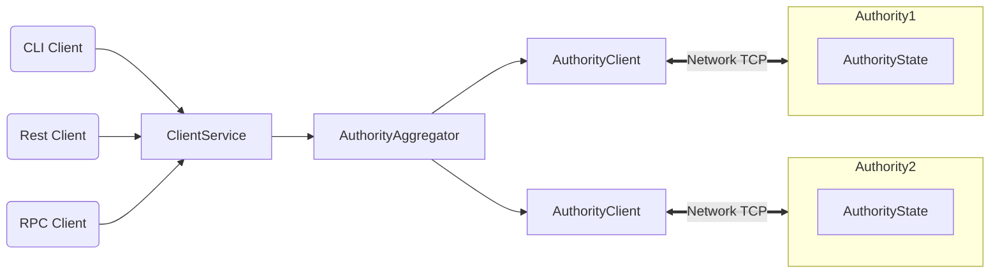

  

# Welcome to MySocial

[MySocial](https://mysocial.network) is a next-generation SocialFi + DataFi social economy with high throughput, low latency, and an asset-oriented programming model powered by the [Move programming language](https://github.com/MystenLabs/awesome-move).

## MySocial Highlights

MySocial offers the following benefits and capabilities:

 * Unmatched scalability, instant settlement
 * Ability to define rich and composable on-chain assets
 * Better user experience for web3 apps

MySocial is the only SocialFi blockchain that can scale with the growth of web3 while achieving industry-top performance, cost, programmability, and usability. MySocial demonstrates capacity beyond the transaction processing capabilities of established systems – traditional and blockchain alike. MySocial is the first internet-scale programmable blockchain platform, a foundational layer for web3.

## MySocial Architecture

## MySocial Overview

MySocial is a smart contract platform maintained by a permissionless set of authorities that play a role similar to validators or miners in other blockchain systems.

MySocial offers scalability and unprecedented low-latency for common use cases. MySocial makes the vast majority of transactions processable in parallel, which makes better use of processing resources, and offers the option to increase throughput with more resources. MySocial forgoes consensus to instead use simpler and lower-latency primitives for common use cases, such as payment transactions and asset transfers. This is unprecedented in the blockchain world and enables a number of new latency-sensitive distributed applications, ranging from gaming to retail payment at physical points of sale.

MySocial is written in [Rust](https://www.rust-lang.org) and supports smart contracts written in the [Move programming language](https://github.com/move-language/move) to define assets that may have an owner. Move programs define operations on these assets including custom rules for their creation, the transfer of these assets to new owners, and operations that mutate assets.

MySocial has a native token called MySo, that holds a fixed supply with deflationary mechanisms. The MySo token is used to pay for gas, and is also used as [delegated stake on authorities](https://learn.bybit.com/blockchain/delegated-proof-of-stake-dpos/) within an epoch. The voting power of authorities within this epoch is a function of this delegated stake. Authorities are periodically reconfigured according to the stake delegated to them. In any epoch, the set of authorities is [Byzantine fault tolerant](https://pmg.csail.mit.edu/papers/osdi99.pdf). At the end of the epoch, fees collected through all transactions processed are distributed to authorities according to their contribution to the operation of the system. Authorities can in turn share some of the fees as rewards to users that delegated stakes to them.

MySocial is supported by several cutting-edge [peer-reviewed studies](https://github.com/MystenLabs/myso/blob/main/docs/content/concepts/research-papers.mdx) and extensive years of open-source development.

## More About MySocial

Use the following links to learn more about MySocial and the MySo ecosystem:

 * Learn more about working with MySocial in the [MySocial Documentation](https://docs.myso.io/).
 * Join the MySocial community on [MySocial Telegram](https://t.me/mysocial_chain).
 * Review information about the MySocial [governance](https://docs.mysocial.network/mysocial/blockchain/social/governance), [decentralization](https://docs.mysocial.network/mysocial/getting-started/decentralization), and the [Social Proof Foundation](https://socialproof.foundation) site.

 ## How to Contribute

 See the [Contributing Guide](CONTRIBUTING.md) for details on how to contribute to MySocial.

 ## Code of Conduct

 See the [Code of Conduct](CODE_OF_CONDUCT.MD) for details on our code of conduct.

 ## License

 See the [LICENSE](LICENSE) file for more details.
